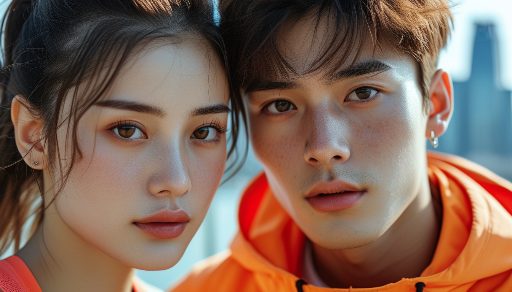

<p align="left">
    中文</a>&nbsp ｜ &nbsp<a href="README.md">English</a>&nbsp
</p>
<!-- <br><br> -->

<p align="center">
    
<p>
<br>

<!-- <div align="center">

<a href='https://kwai-kolors.github.io/'></a> <a href=''></a> [](https://kolors.kuaishou.com/)

</div> -->

<div align="center">
  <a href='https://huggingface.co/Kwai-Kolors/Kolors'></a> &ensp;
  <a href="https://github.com/Kwai-Kolors/Kolors"></a> &ensp;
  <a href="https://kwai-kolors.github.io/"></a> &ensp;

<a href='https://huggingface.co/spaces/Kwai-Kolors/Kolors '></a> &ensp;
  <a href="https://github.com/Kwai-Kolors/Kolors/blob/master/imgs/Kolors_paper.pdf"></a> &ensp;
  <a href="https://kolors.kuaishou.com/"></a> &ensp;
</div>


</p>

# Kolors: Effective Training of Diffusion Model for Photorealistic Text-to-Image Synthesis
<figure>
  
</figure>
<br><br>

##  目录

- [🎉 新闻](#新闻)
- [📑 开源计划](#开源计划)
- [📖 模型介绍](#模型介绍)
- [📊 评测表现 🥇🥇🔥🔥](#评测表现)
- [🎥 可视化](#可视化)
- [🛠️ 快速使用](#快速使用)
- [📜 协议、引用、致谢](#协议引用)
<br><br>

## <a name="新闻"></a>🎉 新闻
* 2024.09.01 🔥 Kolors-Virtual-Try-On 可图虚拟试衣项目体验demo已发布！欢迎体验 [Kolors-Virtual-Try-On](https://huggingface.co/spaces/Kwai-Kolors/Kolors-Virtual-Try-On)， [可图公众号](https://mp.weixin.qq.com/s/Wk_Eq7OAywlrPqNC6zWZJQ)。
  
* 2024.08.06 🔥 Pose ControlNet 已发布! 请查看 [ControlNet(Pose)](./controlnet/) 获取详细信息。

* 2024.08.01 🔥 Kolors-Dreambooth-LoRA 的训练和推理代码已发布！请查看 [Dreambooth-LoRA](./dreambooth/) 获取详细信息。

* 2024.07.31 🔥 Kolors-IP-Adapter-FaceID-Plus 的权重和推理代码已发布！请查看 [IP-Adapter-FaceID-Plus](./ipadapter_FaceID/) 获取详细信息。

* 2024.07.26 🔥 Kolors发布了ControlNet和Inpainting Model! 请查看 [ControlNet(Canny, Depth)](./controlnet/) 和[Inpainting Model](./inpainting/) 获取详细信息。

* 2024.07.17 🔥 Kolors-IP-Adapter-Plus 的权重和推理代码已发布！请查看 [IP-Adapter-Plus](./ipadapter/) 获取详细信息。

* 2024.07.12 🤗 Kolors 已支持 **Diffusers**! 使用方式可参考 [kolors-diffusers](https://huggingface.co/Kwai-Kolors/Kolors-diffusers)或[下面的例子](#using-with-diffusers) ! 感谢 Diffusers 官方提供的技术支持。
* 2024.07.10 🤖 Kolors 支持了 [ModelScope](https://modelscope.cn/models/Kwai-Kolors/Kolors).
* 2024.07.09 💥 Kolors 支持了 [ComfyUI](https://github.com/comfyanonymous/ComfyUI#manual-install-windows-linux)，感谢 [@kijai](https://github.com/kijai/ComfyUI-KwaiKolorsWrapper) 的工作。
* 2024.07.06 🔥🔥🔥 我们开源了基于隐空间扩散的文生图大模型 **Kolors** ，该模型基于数十亿图文对进行训练，支持256的上下文token数，支持中英双语，技术细节参考[技术报告](https://github.com/Kwai-Kolors/Kolors/blob/master/imgs/Kolors_paper.pdf)。
* 2024.07.03 📊 Kolors 在智源研究院 [FlagEval 多模态文生图](https://flageval.baai.ac.cn/#/leaderboard/multimodal?kind=t2i)评测中取得第二名，其中中文主观质量、英文主观质量两个单项排名第一。
* 2024.07.02 🎉 祝贺，可图项目组提出的可控视频生成方法 [DragAnything: Motion Control for Anything using Entity Representation](https://arxiv.org/abs/2403.07420)  被 ECCV 2024 接收。
* 2024.02.08 🎉 祝贺，可图项目组提出的生成模型评估方法 [Learning Multi-dimensional Human Preference for Text-to-Image Generation](https://wangbohan97.github.io/MPS/)  被 CVPR 2024 接收。
<br><br>

## <a name="开源计划"></a>📑 开源计划

- Kolors (Text-to-Image Model)
  - [x] Inference 
  - [x] Checkpoints 
  - [x] IP-Adapter
  - [x] ControlNet (Canny, Depth)
  - [x] Inpainting
  - [x] IP-Adapter-FaceID
  - [x] LoRA
  - [x] ControlNet (Pose)
- [x] ComfyUI
- [x] Gradio
- [x] Diffusers
<br><br>

## <a name="模型介绍"></a>📖 模型介绍
可图大模型是由快手可图团队开发的基于潜在扩散的大规模文本到图像生成模型。Kolors 在数十亿图文对下进行训练，在视觉质量、复杂语义理解、文字生成（中英文字符）等方面，相比于开源/闭源模型，都展示出了巨大的优势。同时，Kolors 支持中英双语，在中文特色内容理解方面更具竞争力。更多的实验结果和细节请查看我们的<a href="https://github.com/Kwai-Kolors/Kolors/blob/master/imgs/Kolors_paper.pdf">技术报告</a></b>。
<br><br>

## <a name="评测表现"></a>📊 评测表现
为了全面比较 Kolors 与其他模型的生成能力，我们构建了包含人工评估、机器评估的全面评测内容。
在相关基准评测中，Kolors 具有非常有竞争力的表现，达到业界领先水平。我们构建了一个包含14种垂类，12个挑战项，总数量为一千多个 prompt 的文生图评估集 KolorsPrompts。在 KolorsPrompts 上，我们收集了 Kolors 与市面上常见的 SOTA 级别的开源/闭源系统的文生图结果，并进行了人工评测和机器评测。
<br><br>

### 人工评测

我们邀请了50个具有图像领域知识的专业评估人员对不同模型的生成结果进行对比评估，为生成图像打分，衡量维度为：画面质量、图文相关性、整体满意度三个方面。
Kolors 在整体满意度方面处于最优水平，其中画面质量显著领先其他模型。
<div style="text-align: center;">

|       模型       | 整体满意度平均分 | 画面质量平均分 | 图文相关性平均分 |
| :--------------: | :--------: | :--------: | :--------: |
|  Adobe-Firefly   |    3.03    |    3.46    |    3.84    |
| Stable Diffusion 3 |    3.26    |    3.50    |    4.20    |
|     DALL-E 3      |    3.32    |    3.54    |    4.22    |
|  Midjourney-v5   |    3.32    |    3.68    |    4.02    |
| Playground-v2.5  |    3.37    |    3.73    |    4.04    |
|  Midjourney-v6   |    3.58    |    3.92    |    4.18    |
|    **Kolors**    |    **3.59**    |    **3.99**    |    **4.17**    |

</div>


<div style="color: gray; font-size: small;">

**所有模型结果取自 2024.04 的产品版本**

</div>
<br>

### 机器评测
我们采用 [MPS](https://arxiv.org/abs/2405.14705) (Multi-dimensional Human preference Score) 来评估上述模型。
我们以 KolorsPrompts 作为基础评估数据集，计算多个模型的 MPS 指标。Kolors 实现了最高的MPS 指标，这与人工评估的指标一致。

<div style="text-align:center">

| 模型            | MPS综合得分 |
|-------------------|-------------|
| Adobe-Firefly     | 8.5     |
| Stable Diffusion 3  | 8.9      |
| DALL-E 3           |   9.0    |
| Midjourney-v5     | 9.4      |
| Playground-v2.5   | 9.8      |
| Midjourney-v6     | 10.2      |
| **Kolors**            | **10.3**      |
</div>


<br>

更多的实验结果和细节请查看我们的技术报告。点击[技术报告](https://github.com/Kwai-Kolors/Kolors/blob/master/imgs/Kolors_paper.pdf)。
<br><br>

## <a name="可视化"></a>🎥 可视化

* **高质量人像**
<div style="display: flex; justify-content: space-between;">
  
</div>
<br>

* **中国元素**
<div style="display: flex; justify-content: space-between;">
  
</div>
<br>

* **复杂语义理解**
<div style="display: flex; justify-content: space-between;">
  
</div>
<br>

* **文字绘制**
<div style="display: flex; justify-content: space-between;">
  
</div>
<br>
</div>

上述可视化 case，可以点击[可视化prompts](https://github.com/Kwai-Kolors/Kolors/blob/master/imgs/prompt_vis.txt) 获取
<br><br>

## <a name="快速使用"></a>🛠️ 快速使用

### 要求

* python 3.8及以上版本
* pytorch 1.13.1及以上版本
* transformers 4.26.1及以上版本
* 建议使用CUDA 11.7及以上
<br>

1、仓库克隆及依赖安装
```bash
apt-get install git-lfs
git clone https://github.com/Kwai-Kolors/Kolors
cd Kolors
conda create --name kolors python=3.8
conda activate kolors
pip install -r requirements.txt
python3 setup.py install
```
2、模型权重下载（[链接](https://huggingface.co/Kwai-Kolors/Kolors)）：
```bash
huggingface-cli download --resume-download Kwai-Kolors/Kolors --local-dir weights/Kolors
```
或者
```bash
git lfs clone https://huggingface.co/Kwai-Kolors/Kolors weights/Kolors
```
3、模型推理：
```bash
python3 scripts/sample.py "一张瓢虫的照片，微距，变焦，高质量，电影，拿着一个牌子，写着“可图”"
# The image will be saved to "scripts/outputs/sample_text.jpg"
```
4、 Web demo：
```bash
python3 scripts/sampleui.py
```

### 在 Diffusers 中使用
确保您安装了最新版本的 `diffusers`(0.30.0.dev0): 
```
git clone https://github.com/huggingface/diffusers
cd diffusers
python3 setup.py install
```
**注意:**
- KolorsPipeline 默认使用`EulerDiscreteScheduler` 作为噪声调度器。我们推荐使用该调度器时搭配 `guidance scale=5.0` 及 `num_inference_steps=50`。
- KolorsPipeline 同时支持 `EDMDPMSolverMultistepScheduler`。在使用该噪声调度器时，推荐使用参数 `guidance scale=5.0`及`num_inference_steps=25`。
- 除了文生图能力，`KolorsImg2ImgPipeline` 同时也支持图文生图功能。

运行以下指令进行图像生成:
```python
import torch
from diffusers import KolorsPipeline
pipe = KolorsPipeline.from_pretrained(
    "Kwai-Kolors/Kolors-diffusers", 
    torch_dtype=torch.float16, 
    variant="fp16"
).to("cuda")
prompt = '一张瓢虫的照片，微距，变焦，高质量，电影，拿着一个牌子，写着"可图"'
image = pipe(
    prompt=prompt,
    negative_prompt="",
    guidance_scale=5.0,
    num_inference_steps=50,
    generator=torch.Generator(pipe.device).manual_seed(66),
).images[0]
image.show()
```
### IP-Adapter-Plus

我们提供了 IP-Adapter-Plus 的参数和代码, 详细信息见 [ipadapter](./ipadapter/README.md).

```bash
# Weights download
huggingface-cli download --resume-download Kwai-Kolors/Kolors-IP-Adapter-Plus --local-dir weights/Kolors-IP-Adapter-Plus
```

```bash
# Inference：
python3 ipadapter/sample_ipadapter_plus.py ./ipadapter/asset/test_ip.jpg "穿着黑色T恤衫，上面中文绿色大字写着“可图”"

python3 ipadapter/sample_ipadapter_plus.py ./ipadapter/asset/test_ip2.png "一只可爱的小狗在奔跑"

# The image will be saved to "scripts/outputs/"
```


### ControlNet

我们提供了三个类型的ControlNet参数和代码，详细信息见[controlnet](./controlnet/README.md)。

```bash
# Weights download

# Canny - ControlNet
huggingface-cli download --resume-download Kwai-Kolors/Kolors-ControlNet-Canny --local-dir weights/Kolors-ControlNet-Canny

# Depth - ControlNet
huggingface-cli download --resume-download Kwai-Kolors/Kolors-ControlNet-Depth --local-dir weights/Kolors-ControlNet-Depth

# Pose - ControlNet
huggingface-cli download --resume-download Kwai-Kolors/Kolors-ControlNet-Pose --local-dir weights/Kolors-ControlNet-Pose
```
如果你打算使用深度估计网络，请确保下载其相应的模型权重。
```
huggingface-cli download lllyasviel/Annotators ./dpt_hybrid-midas-501f0c75.pt --local-dir ./controlnet/annotator/ckpts  
```

感谢[DWPose](https://github.com/IDEA-Research/DWPose/tree/onnx?tab=readme-ov-file)，你可以使用姿态预测网络。 请下载姿态模型 dw-ll_ucoco_384.onnx ([baidu](https://pan.baidu.com/s/1nuBjw-KKSxD_BkpmwXUJiw?pwd=28d7), [google](https://drive.google.com/file/d/12L8E2oAgZy4VACGSK9RaZBZrfgx7VTA2/view?usp=sharing)) 和检测模型 yolox_l.onnx ([baidu](https://pan.baidu.com/s/1fpfIVpv5ypo4c1bUlzkMYQ?pwd=mjdn), [google](https://drive.google.com/file/d/1w9pXC8tT0p9ndMN-CArp1__b2GbzewWI/view?usp=sharing))。然后请将它们放入 `controlnet/annotator/ckpts/`。


```bash
# Inference：

python ./controlnet/sample_controlNet.py ./controlnet/assets/woman_1.png 一个漂亮的女孩，高品质，超清晰，色彩鲜艳，超高分辨率，最佳品质，8k，高清，4K Canny

python ./controlnet/sample_controlNet.py ./controlnet/assets/woman_2.png 新海诚风格，丰富的色彩，穿着绿色衬衫的女人站在田野里，唯美风景，清新明亮，斑驳的光影，最好的质量，超细节，8K画质 Depth

python ./controlnet/sample_controlNet.py ./controlnet/assets/woman_3.png 一位穿着紫色泡泡袖连衣裙、戴着皇冠和白色蕾丝手套的女孩双手托脸，高品质，超清晰，色彩鲜艳，超高分辨率，最佳品质，8k，高清，4K Pose

# The image will be saved to "controlnet/outputs/"
```


### Inpainting

我们提供了 Inpainting 的参数和代码, 详细信息见 [inpainting](./inpainting/README.md).

```bash
# Weights download
huggingface-cli download --resume-download Kwai-Kolors/Kolors-Inpainting --local-dir weights/Kolors-Inpainting
```

```bash
# Inference：
python3 inpainting/sample_inpainting.py ./inpainting/asset/3.png ./inpainting/asset/3_mask.png 穿着美少女战士的衣服，一件类似于水手服风格的衣服，包括一个白色紧身上衣，前胸搭配一个大大的红色蝴蝶结。衣服的领子部分呈蓝色，并且有白色条纹。她还穿着一条蓝色百褶裙，超高清，辛烷渲染，高级质感，32k，高分辨率，最好的质量，超级细节，景深

python3 inpainting/sample_inpainting.py ./inpainting/asset/4.png ./inpainting/asset/4_mask.png 穿着钢铁侠的衣服，高科技盔甲，主要颜色为红色和金色，并且有一些银色装饰。胸前有一个亮起的圆形反应堆装置，充满了未来科技感。超清晰，高质量，超逼真，高分辨率，最好的质量，超级细节，景深

# The image will be saved to "scripts/outputs/"
```

### IP-Adapter-FaceID-Plus

我们提供了 IP-Adapter-FaceID-Plus 的参数和代码, 详细信息见 [ipadapter_FaceID](./ipadapter_FaceID/README.md).

```bash
# Weights download
huggingface-cli download --resume-download Kwai-Kolors/Kolors-IP-Adapter-FaceID-Plus --local-dir weights/Kolors-IP-Adapter-FaceID-Plus
```

```bash
# Inference：
python ipadapter_FaceID/sample_ipadapter_faceid_plus.py ./ipadapter_FaceID/assets/image1.png "穿着晚礼服，在星光下的晚宴场景中，烛光闪闪，整个场景洋溢着浪漫而奢华的氛围"

python ipadapter_FaceID/sample_ipadapter_faceid_plus.py ./ipadapter_FaceID/assets/image2.png "西部牛仔，牛仔帽，荒野大镖客，背景是西部小镇，仙人掌，,日落余晖, 暖色调, 使用XT4胶片拍摄, 噪点, 晕影, 柯达胶卷，复古"

# The image will be saved to "scripts/outputs/"
```

### Dreambooth-LoRA

我们提供了Dreambooth-LoRA 的训练和推理代码，详细信息见 [Dreambooth-LoRA](./dreambooth/README.md).

```bash
# Training:
sh train.sh
```

```bash
# Inference：
python infer_dreambooth.py "ktxl狗在草地上跑"
```

<br><br>

## <a name="协议引用"></a>📜协议、引用、致谢


### 协议
**Kolors**（可图）权重对学术研究完全开放，若您期望基于本模型协议的许可条件与限制，将可图KOLORS模型或其衍生品用作商业目的，请您将[问卷](https://github.com/Kwai-Kolors/Kolors/blob/master/imgs/可图KOLORS模型商业授权申请书.docx)发送至邮箱kwai-kolors@kuaishou.com，以向许可方登记。若您提供的所有产品或服务的月活跃用户数在前一个自然月未超过3亿月活跃用户数，则您向许可方进行登记，将被视为获得相应的商业许可；若您提供的所有产品或服务的月活跃用户数在前一个自然月超过3亿月活跃用户数，则您必须向许可人申请许可，许可人可自行决定向您授予许可。

本开源模型旨在与开源社区共同推进文生图大模型技术的发展。本项目代码依照 Apache-2.0 协议开源，模型权重需要遵循本《模型许可协议》，我们恳请所有开发者和用户严格遵守[开源协议](MODEL_LICENSE)，避免将开源模型、代码及其衍生物用于任何可能对国家和社会造成危害的用途，或用于任何未经安全评估和备案的服务。需要注意，尽管模型在训练中我们尽力确保数据的合规性、准确性和安全性，但由于视觉生成模型存在生成多样性和可组合性等特点，以及生成模型受概率随机性因素的影响，模型无法保证输出内容的准确性和安全性，且模型易被误导。本项目不对因使用开源模型和代码而导致的任何数据安全问题、舆情风险或因模型被误导、滥用、传播、不当利用而产生的风险和责任承担任何法律责任。

<br>

### 引用
如果你觉得我们的工作对你有帮助，欢迎引用！

```
@article{kolors,
  title={Kolors: Effective Training of Diffusion Model for Photorealistic Text-to-Image Synthesis},
  author={Kolors Team},
  journal={arXiv preprint},
  year={2024}
}
```
<br>

### 致谢
- 感谢 [Diffusers](https://github.com/huggingface/diffusers) 提供的codebase
- 感谢 [ChatGLM3](https://github.com/THUDM/ChatGLM3) 提供的强大中文语言模型
<br>

### 联系我们

如果你想给我们的研发团队和产品团队留言，欢迎加入我们的[微信群](https://github.com/Kwai-Kolors/Kolors/blob/master/imgs/wechat.png)。当然也可以通过邮件（kwai-kolors@kuaishou.com）联系我们。


## Star History

[](https://star-history.com/#Kwai-Kolors/Kolors&Date)
