## <a name="Introduction"></a>📖 Introduction

We provide three ControlNet weights and inference code based on Kolors-Basemodel: Canny, Depth and Pose. You can find some example images below.


**1、ControlNet Demos**

<table >
  
   <tr>
    <td align="center">Condition Image </td>
    <td align="center">Prompt </td>
    <td align="center">Result Image </td>
  </tr>

  <tr>
    <td align="center">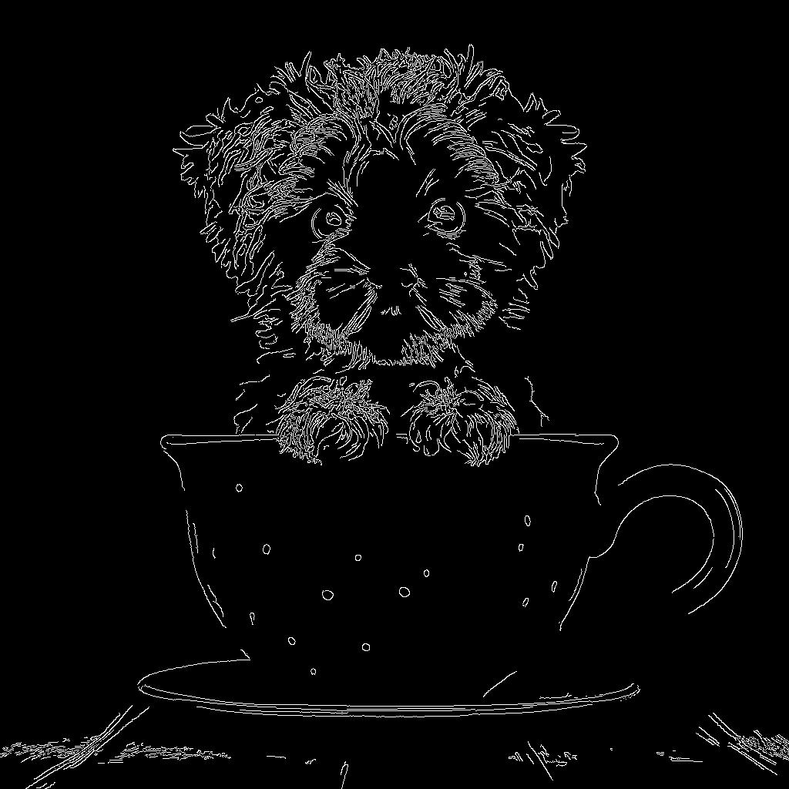</td>
    <td align="center"><font style="font-size:12px">全景，一只可爱的白色小狗坐在杯子里，看向镜头，动漫风格，3d渲染，辛烷值渲染。</p> Panorama of a cute white puppy sitting in a cup and looking towards the camera, anime style, 3d rendering, octane rendering. </font> </td> 
    <td align="center"></td>
  </tr>

  <tr>
    <td align="center">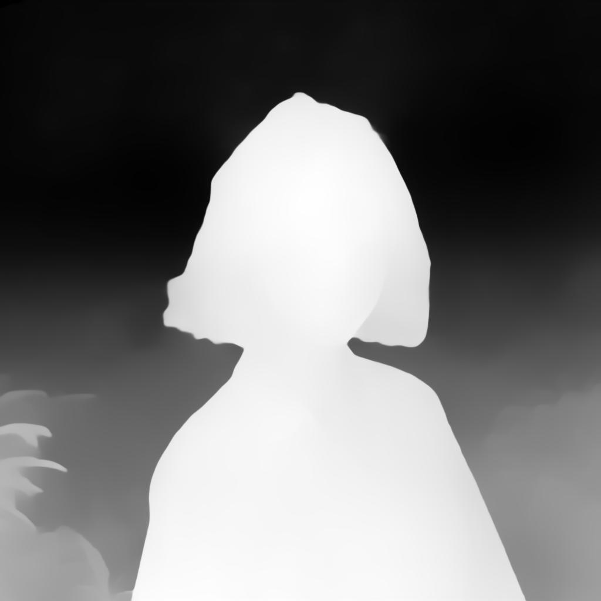</td>
    <td align="center"><font style="font-size:12px">新海诚风格，丰富的色彩，穿着绿色衬衫的女人站在田野里，唯美风景，清新明亮，斑驳的光影，最好的质量，超细节，8K画质。</p> Makoto Shinkai style, rich colors, a woman in a green shirt standing in the field, beautiful scenery, fresh and bright, mottled light and shadow, best quality, ultra-detailed, 8K quality. </font> </td> 
    <td align="center">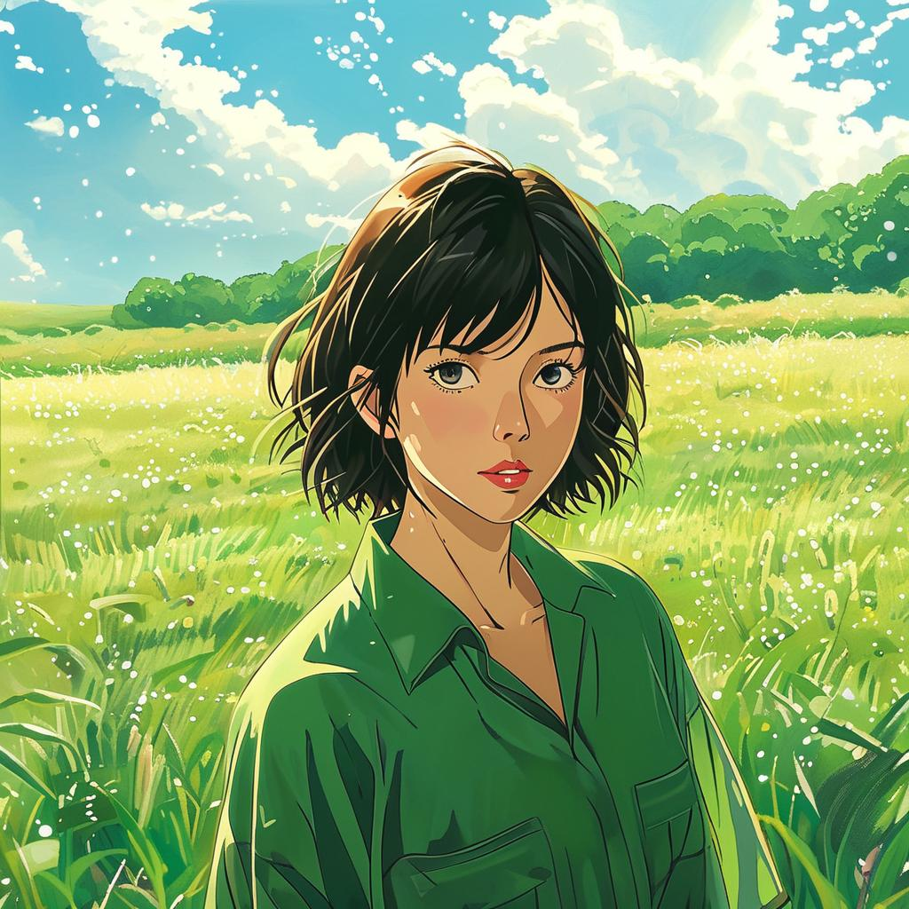</td>
  </tr>

  <tr>
    <td align="center">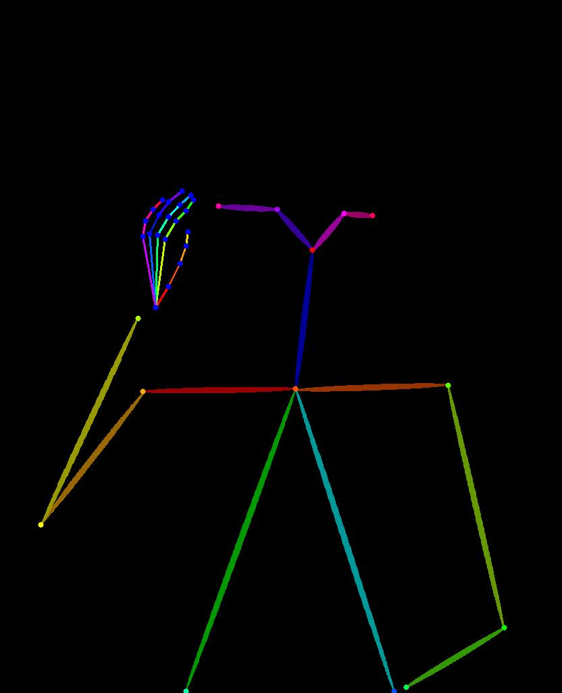</td>
    <td align="center"><font style="font-size:12px">一个穿着黑色运动外套、白色内搭，上面戴着项链的女子，站在街边，背景是红色建筑和绿树，高品质，超清晰，色彩鲜艳，超高分辨率，最佳品质，8k，高清，4K。</p> A woman wearing a black sports jacket and a white top, adorned with a necklace, stands by the street, with a background of red buildings and green trees. high quality, ultra clear, colorful, ultra high resolution, best quality, 8k, HD, 4K. </font> </td> 
    <td align="center">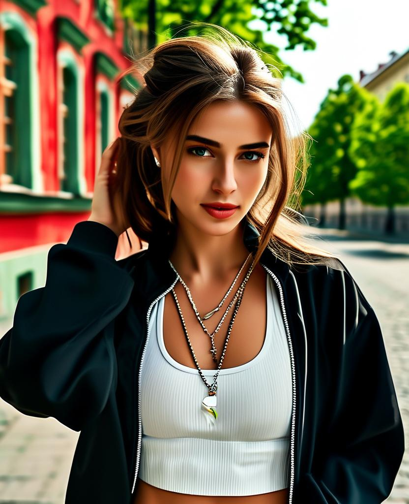</td>
  </tr>
  


</table>


**2、ControlNet and IP-Adapter-Plus Demos**

We also support joint inference code between Kolors-IPadapter and Kolors-ControlNet.

<table >
   <tr>
    <td align="center">Reference Image </td>
    <td align="center">Condition Image </td>
    <td align="center">Prompt </td>
    <td align="center">Result Image </td>
  </tr>

  <tr>
    <td align="center"></td>
    <td align="center"></td>
    <td align="center"><font style="font-size:12px">一个红色头发的女孩，唯美风景，清新明亮，斑驳的光影，最好的质量，超细节，8K画质。</p> A girl with red hair, beautiful scenery, fresh and bright, mottled light and shadow, best quality, ultra-detailed, 8K quality. </font> </td> 
    <td align="center"></td>
  </tr>

  <tr>
    <td align="center"></td>
    <td align="center">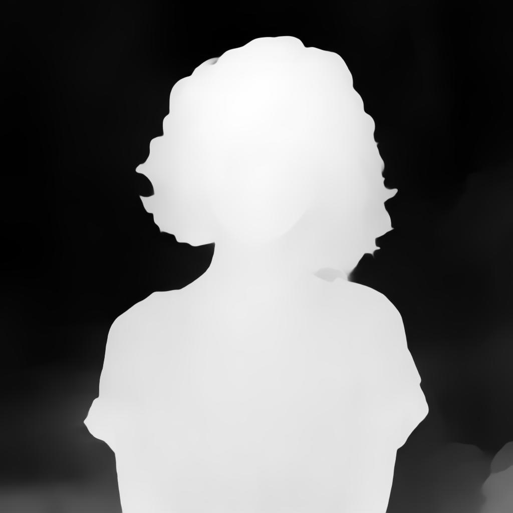</td>
    <td align="center"><font style="font-size:12px">一个漂亮的女孩，最好的质量，超细节，8K画质。</p> A beautiful girl, best quality, super detail, 8K quality. </font> </td> 
    <td align="center">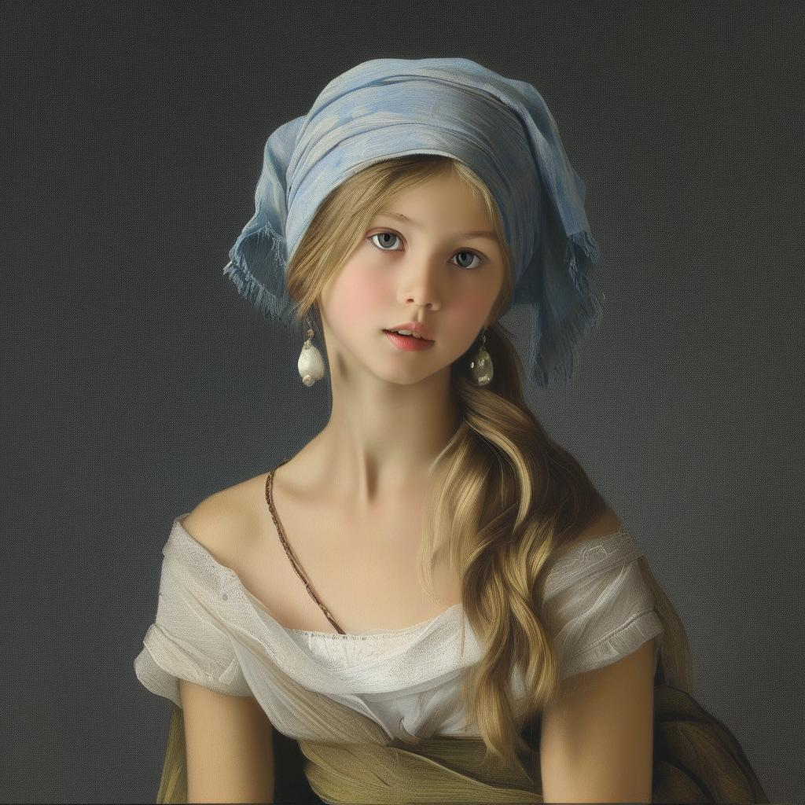</td>
  </tr>

</table>

<br>


## <a name="Evaluation"></a>📊 Evaluation
To evaluate the performance of models, we compiled a test set of more than 200 images and text prompts. We invite several image experts to provide fair ratings for the generated results of different models. The experts rate the generated images based on four criteria: visual appeal, text faithfulness, conditional controllability, and overall satisfaction. Conditional controllability measures controlnet's ability to preserve spatial structure, while the other criteria follow the evaluation standards of BaseModel. The specific results are summarized in the table below, where Kolors-ControlNet achieved better performance in various criterias.

**1、Canny**

|       Model       |  Average Overall Satisfaction | Average Visual Appeal | Average Text Faithfulness | Average Conditional Controllability |
| :--------------: | :--------: | :--------: | :--------: | :--------: |
| SDXL-ControlNet-Canny |	3.14	| 3.63	| 4.37	| 2.84 |
| **Kolors-ControlNet-Canny**  | **4.06** |  **4.64**  | **4.45** | **3.52** |


**2、Depth**

|       Model       |  Average Overall Satisfaction | Average Visual Appeal | Average Text Faithfulness | Average Conditional Controllability |
| :--------------: | :--------: | :--------: | :--------: | :--------: |
| SDXL-ControlNet-Depth |	3.35	| 3.77	| 4.26	| 4.5 |
| **Kolors-ControlNet-Depth**  | **4.12** |  **4.12**  | **4.62** | **4.6** |


**3、Pose**

|       Model       |  Average Overall Satisfaction | Average Visual Appeal | Average Text Faithfulness | Average Conditional Controllability |
| :--------------: | :--------: | :--------: | :--------: | :--------: |
| SDXL-ControlNet-Pose |	1.70	| 2.78	| 4.05	| 1.98 |
| **Kolors-ControlNet-Pose**  | **3.33** |  **3.63**  | **4.78** | **4.4** |


<font color=gray style="font-size:12px">*The [SDXL-ControlNet-Canny](https://huggingface.co/diffusers/controlnet-canny-sdxl-1.0) and [SDXL-ControlNet-Depth](https://huggingface.co/diffusers/controlnet-depth-sdxl-1.0) load [DreamShaper-XL](https://civitai.com/models/112902?modelVersionId=351306) as backbone model.*</font>


<table >
  <tr>
    <td colspan="4" align="center">Compare Result</td>
  </tr>
  
   <tr>
    <td align="center">Condition Image </td>
    <td align="center">Prompt </td>
    <td align="center">Kolors-ControlNet Result </td>
    <td align="center">SDXL-ControlNet Result </td>
  </tr>

  <tr>
    <td align="center">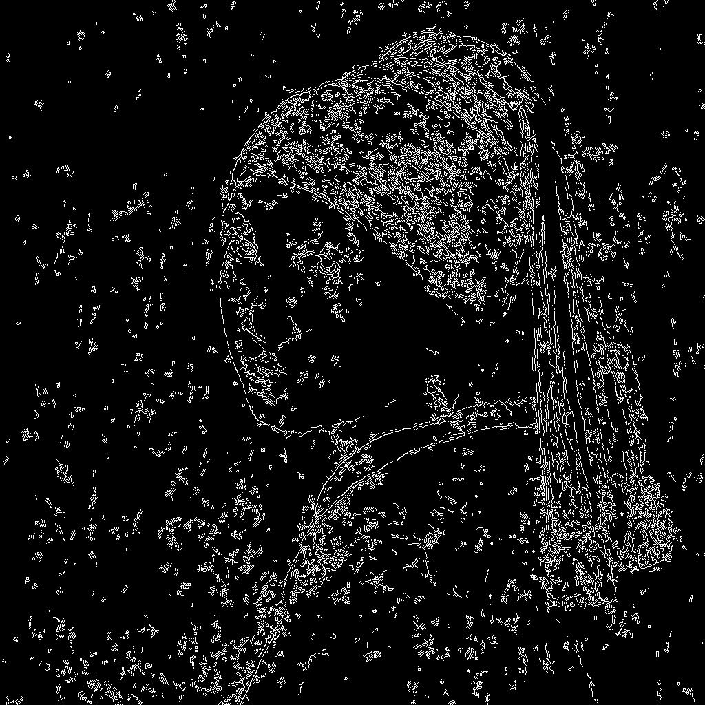</td>
    <td align="center"><font style="font-size:12px">一个漂亮的女孩，高品质，超清晰，色彩鲜艳，超高分辨率，最佳品质，8k，高清，4K。</p> A beautiful girl, high quality, ultra clear, colorful, ultra high resolution, best quality, 8k, HD, 4K. </font> </td> 
    <td align="center">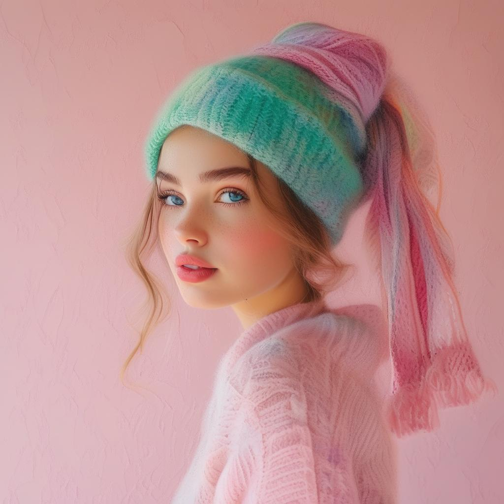</td>
    <td align="center"></td>
  </tr>


  <tr>
    <td align="center">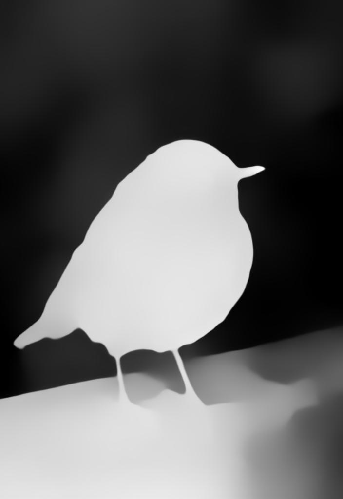</td>
    <td align="center"><font style="font-size:12px">一只颜色鲜艳的小鸟，高品质，超清晰，色彩鲜艳，超高分辨率，最佳品质，8k，高清，4K。</p> A colorful bird, high quality, ultra clear, colorful, ultra high resolution, best quality, 8k, HD, 4K. </font> </td> 
    <td align="center">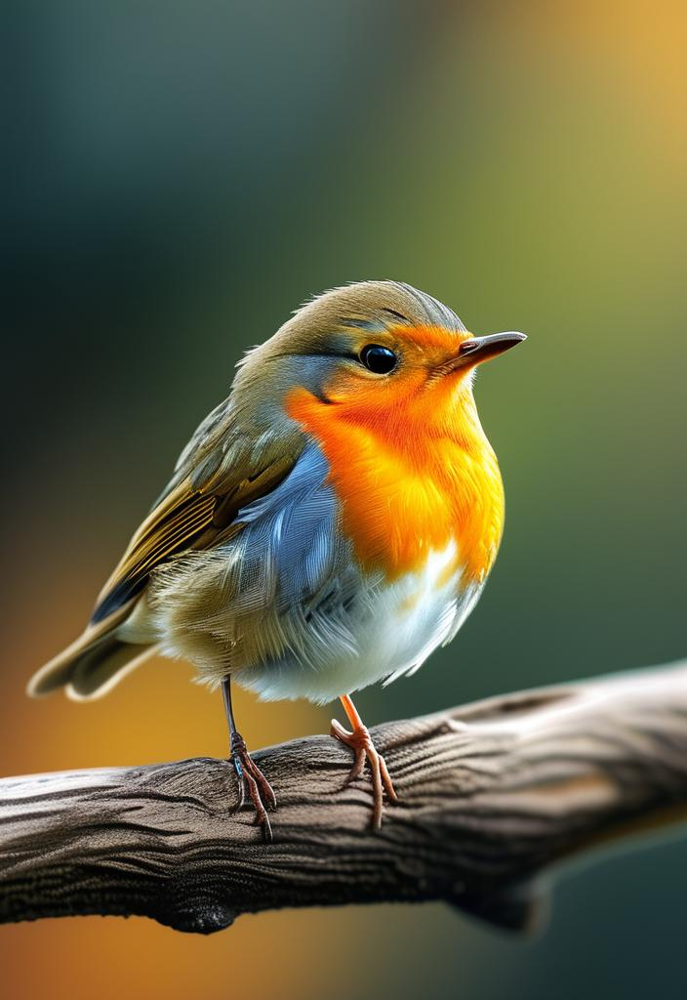</td>
    <td align="center">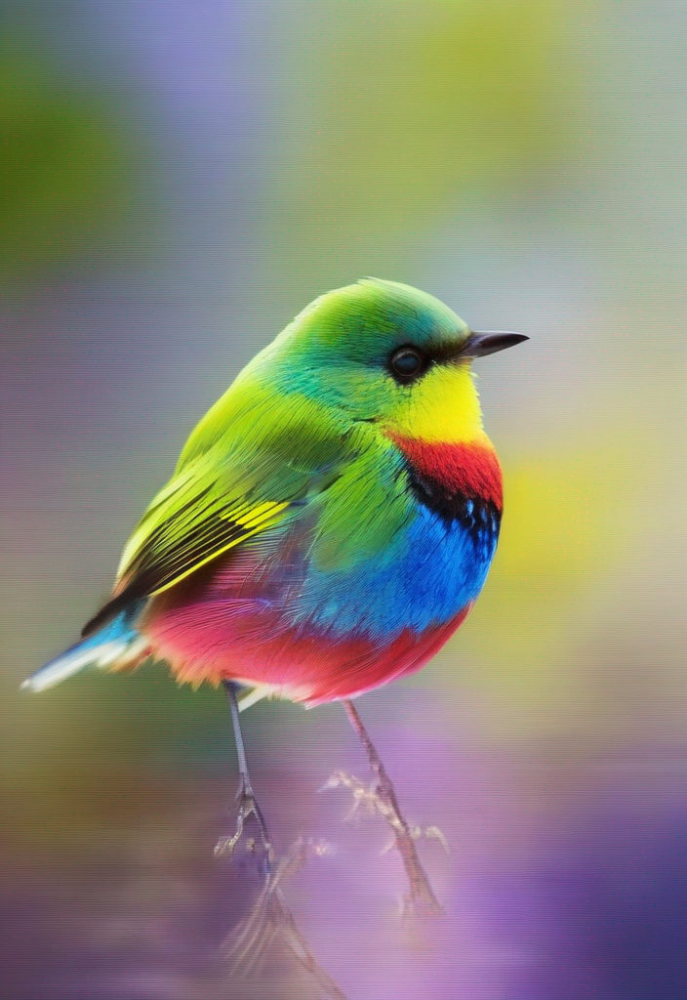</td>
  </tr>

   <tr>
    <td align="center">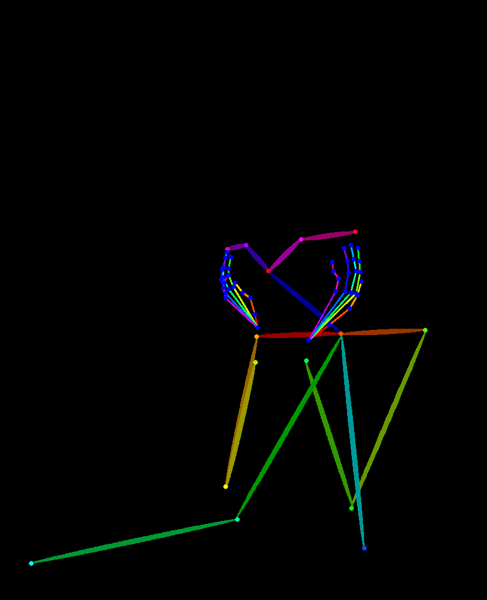</td>
    <td align="center"><font style="font-size:12px">一位穿着紫色泡泡袖连衣裙、戴着皇冠和白色蕾丝手套的女孩双手托脸，高品质，超清晰，色彩鲜艳，超高分辨率 ，最佳品质，8k，高清，4K。</p> A girl wearing a purple puff-sleeve dress, with a crown and white lace gloves, is cupping her face with both hands. High quality, ultra-clear, vibrant colors, ultra-high resolution, best quality, 8k, HD, 4K. </font> </td> 
    <td align="center">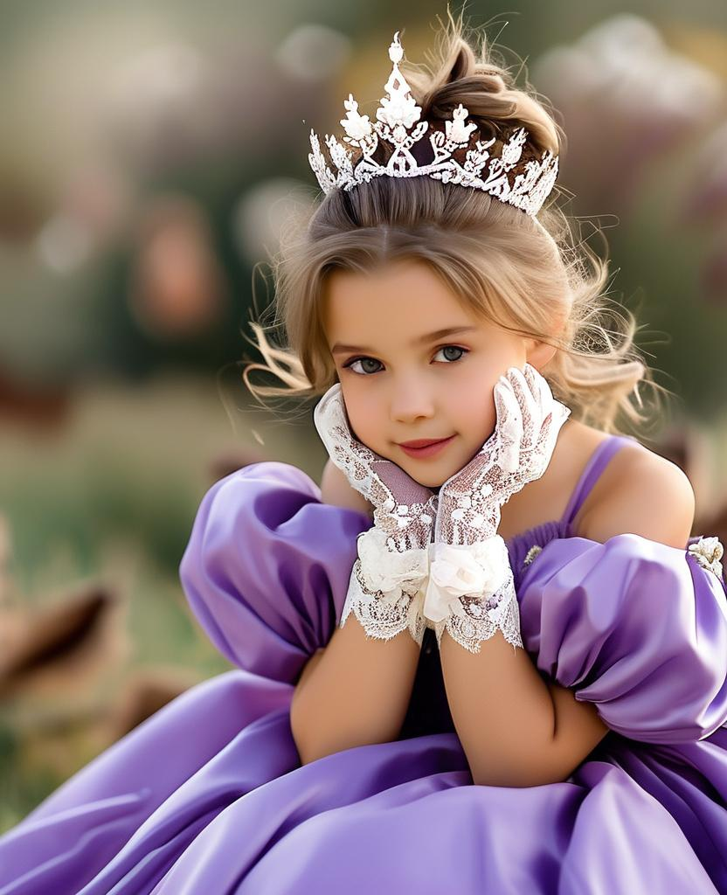</td>
    <td align="center"></td>
  </tr>


</table>


------


## <a name="Usage"></a>🛠️ Usage

### Requirements

The dependencies and installation are basically the same as the [Kolors-BaseModel](https://huggingface.co/Kwai-Kolors/Kolors).

<br>


### Weights download
```bash
# Canny - ControlNet
huggingface-cli download --resume-download Kwai-Kolors/Kolors-ControlNet-Canny --local-dir weights/Kolors-ControlNet-Canny

# Depth - ControlNet
huggingface-cli download --resume-download Kwai-Kolors/Kolors-ControlNet-Depth --local-dir weights/Kolors-ControlNet-Depth

# Pose - ControlNet
huggingface-cli download --resume-download Kwai-Kolors/Kolors-ControlNet-Pose --local-dir weights/Kolors-ControlNet-Pose
```

If you intend to utilize the depth estimation network, please make sure to download its corresponding model weights.
```
huggingface-cli download lllyasviel/Annotators ./dpt_hybrid-midas-501f0c75.pt --local-dir ./controlnet/annotator/ckpts
```

Thanks to [DWPose](https://github.com/IDEA-Research/DWPose/tree/onnx?tab=readme-ov-file), you can utilize the pose estimation network. Please download the Pose model dw-ll_ucoco_384.onnx ([baidu](https://pan.baidu.com/s/1nuBjw-KKSxD_BkpmwXUJiw?pwd=28d7), [google](https://drive.google.com/file/d/12L8E2oAgZy4VACGSK9RaZBZrfgx7VTA2/view?usp=sharing)) and Det model yolox_l.onnx ([baidu](https://pan.baidu.com/s/1fpfIVpv5ypo4c1bUlzkMYQ?pwd=mjdn), [google](https://drive.google.com/file/d/1w9pXC8tT0p9ndMN-CArp1__b2GbzewWI/view?usp=sharing)). Then please put them into `controlnet/annotator/ckpts/`.


### Inference


**a. Using canny ControlNet:**

```bash
python ./controlnet/sample_controlNet.py ./controlnet/assets/woman_1.png 一个漂亮的女孩，高品质，超清晰，色彩鲜艳，超高分辨率，最佳品质，8k，高清，4K Canny

python ./controlnet/sample_controlNet.py ./controlnet/assets/dog.png 全景，一只可爱的白色小狗坐在杯子里，看向镜头，动漫风格，3d渲染，辛烷值渲染 Canny

# The image will be saved to "controlnet/outputs/"
```

**b. Using depth ControlNet:**

```bash
python ./controlnet/sample_controlNet.py ./controlnet/assets/woman_2.png 新海诚风格，丰富的色彩，穿着绿色衬衫的女人站在田野里，唯美风景，清新明亮，斑驳的光影，最好的质量，超细节，8K画质 Depth

python ./controlnet/sample_controlNet.py ./controlnet/assets/bird.png 一只颜色鲜艳的小鸟，高品质，超清晰，色彩鲜艳，超高分辨率，最佳品质，8k，高清，4K Depth

# The image will be saved to "controlnet/outputs/"
```

**c. Using pose ControlNet:**

```bash
python ./controlnet/sample_controlNet.py ./controlnet/assets/woman_3.png 一位穿着紫色泡泡袖连衣裙、戴着皇冠和白色蕾丝手套的女孩双手托脸，高品质，超清晰，色彩鲜艳，超高分辨率，最佳品质，8k，高清，4K Pose

python ./controlnet/sample_controlNet.py ./controlnet/assets/woman_4.png 一个穿着黑色运动外套、白色内搭，上面戴着项链的女子，站在街边，背景是红色建筑和绿树，高品质，超清晰，色彩鲜艳，超高分辨率，最佳品质，8k，高清，4K Pose

# The image will be saved to "controlnet/outputs/"
```


**c. Using depth ControlNet + IP-Adapter-Plus:**

If you intend to utilize the kolors-ip-adapter-plus, please make sure to download its corresponding model weights.

```bash
python ./controlnet/sample_controlNet_ipadapter.py ./controlnet/assets/woman_2.png ./ipadapter/asset/2.png  一个红色头发的女孩，唯美风景，清新明亮，斑驳的光影，最好的质量，超细节，8K画质 Depth

python ./controlnet/sample_controlNet_ipadapter.py ./ipadapter/asset/1.png ./controlnet/assets/woman_1.png  一个漂亮的女孩，最好的质量，超细节，8K画质 Depth

# The image will be saved to "controlnet/outputs/"
```

<br>


### Acknowledgments
- Thanks to [ControlNet](https://github.com/lllyasviel/ControlNet) for providing the codebase.

<br>


