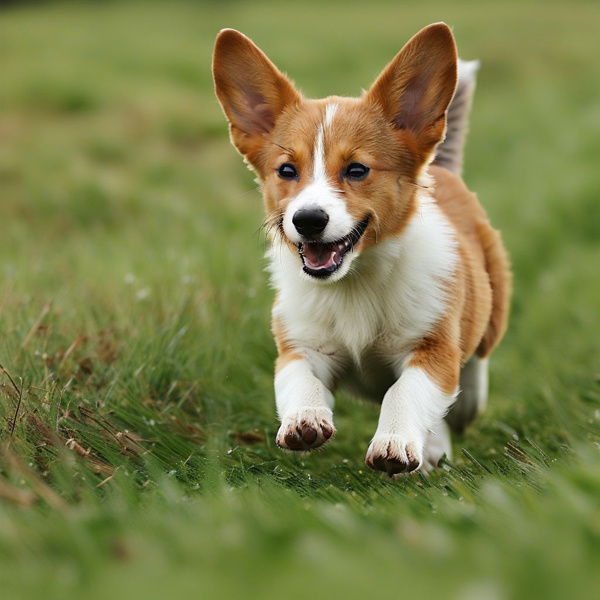

## <a name="Introduction"></a>📖 Introduction
We Provide LoRA  training and inference code based on [Kolors-Basemodel](https://huggingface.co/Kwai-Kolors/Kolors), along with an IP LoRA training example.

<table >
  <tr>
    <td colspan="3" align="center">Example Result</td>
  </tr>
  
   <tr>
    <td align="center">Prompt </td>
    <td align="center">Result Image </td>
  </tr>

  <tr>
    </td>
    <td align="center"><font style="font-size:12px">ktxl狗在草地上跑。</p>  </font> </td> 
    <td align="center"></td>
  </tr>


  
</table>

<br>

**Our improvements**

- Supporting user-defined caption files. By putting the '.txt' file with the same name as the image file in the same directory, the caption file will be automatically matched with the proper image

## <a name="Usage"></a>🛠️ Usage

### Requirements

The dependencies and installation are basically the same as the [Kolors-BaseModel](https://huggingface.co/Kwai-Kolors/Kolors).

1. Repository Cloning and Dependency Installation

```bash
apt-get install git-lfs
git clone https://github.com/Kwai-Kolors/Kolors
cd Kolors
conda create --name kolors python=3.8
conda activate kolors
pip install -r requirements.txt
python3 setup.py install
```
### Training

1. First, we need to get our datasaet.https://huggingface.co/datasets/diffusers/dog-example.
    ```python
    from huggingface_hub import snapshot_download

    local_dir = "./dog"
    snapshot_download(
        "diffusers/dog-example",
        local_dir=local_dir, repo_type="dataset",
        ignore_patterns=".gitattributes",
    )
    ```

      **___Note: To load caption files automatically during training, you can use the same name for both the image and its corresponding '.txt' caption file.___**


2. Launch the training using:
   ```bash
    sh train.sh
    ```
  
3. Training configuration. We train the model using the default configuration in the `train.sh` file on 8 V100 GPUs, consuming a total of 27GB of the memory. You can also finetune the text encoder by adding `--train_text_encoder`:
   ```bash
    MODEL_NAME="/path/base_model_path"
    CLASS_DIR="/path/regularization_image_path"
    INSTANCE_DIR="path/training_image_path"
    OUTPUT_DIR="./trained_models"
    cfg_file=./default_config.yaml

    accelerate launch --config_file ${cfg_file} train_dreambooth_lora.py \
        --pretrained_model_name_or_path=$MODEL_NAME  \
        --instance_data_dir=$INSTANCE_DIR \
        --output_dir=$OUTPUT_DIR \
        --class_data_dir=$CLASS_DIR \
        --instance_prompt="ktxl狗" \
        --class_prompt="狗" \
        --train_batch_size=1 \
        --gradient_accumulation_steps=1 \
        --learning_rate=2e-5 \
        --text_encoder_lr=5e-5 \
        --lr_scheduler="polynomial" \
        --lr_warmup_steps=100 \
        --rank=4 \
        --resolution=1024 \
        --max_train_steps=2000 \
        --checkpointing_steps=200 \
        --num_class_images=100 \
        --center_crop \
        --mixed_precision='fp16' \
        --seed=19980818 \
        --img_repeat_nums=1 \
        --sample_batch_size=2 \
        --use_preffix_prompt \
        --gradient_checkpointing \
        --train_text_encoder \
        --adam_weight_decay=1e-02 \
        --with_prior_preservation  \
        --prior_loss_weight=0.7 \

    ```


    **___Note: Most of our training configurations stay the same with official [diffusers](https://github.com/huggingface/diffusers/tree/main/examples/dreambooth) .___**

### Inference
  ```bash
    python infer_dreambooth.py "ktxl狗在草地上跑"
  ```
