## <a name="Introduction"></a>📖 Introduction

We provide Kolors-Inpainting inference code and weights which were initialized with [Kolors-Basemodel](https://huggingface.co/Kwai-Kolors/Kolors). Examples of Kolors-Inpainting results are as follows:


<table >
  <tr>
    <td colspan="4" align="center">Inpainting Results</td>
  </tr>
  
   <tr>
    <td align="center">Original Image </td>
    <td align="center">Masked Image </td>
    <td align="center">Prompt </td>
    <td align="center">Result Image </td>
  </tr>

  <tr>
    <td align="center">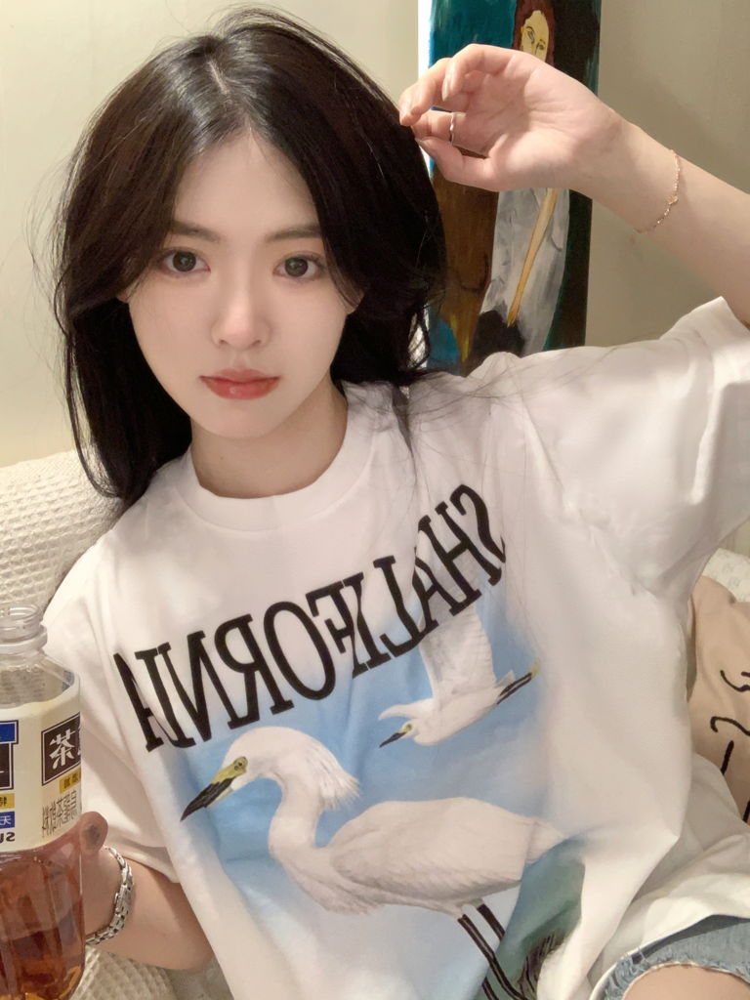</td>
    <td align="center">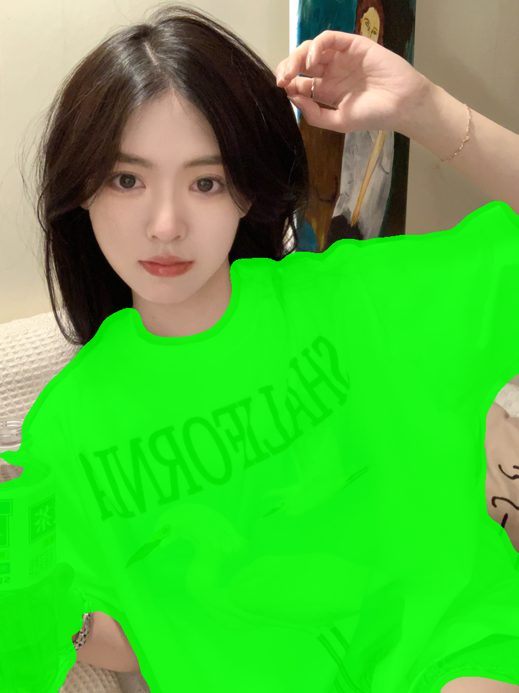</td>
    <td align="center"><font style="font-size:12px">穿着美少女战士的衣服，一件类似于水手服风格的衣服，包括一个白色紧身上衣，前胸搭配一个大大的红色蝴蝶结。衣服的领子部分呈蓝色，并且有白色条纹。她还穿着一条蓝色百褶裙，超高清，辛烷渲染，高级质感，32k，高分辨率，最好的质量，超级细节，景深</p> Wearing Sailor Moon's outfit, a sailor-style outfit consisting of a white tight top with a large red bow on the chest. The collar of the outfit is blue and has white stripes. She also wears a blue pleated skirt, Ultra HD, Octane Rendering, Premium Textures, 32k, High Resolution, Best Quality, Super Detail, Depth of Field</font> </td> 
    <td align="center"></td>
  </tr>

  <tr>
    <td align="center">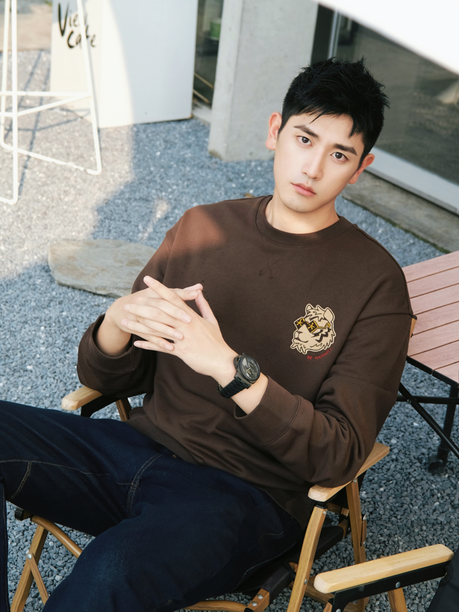</td>
    <td align="center"></td>
    <td align="center"><font style="font-size:12px">穿着钢铁侠的衣服，高科技盔甲，主要颜色为红色和金色，并且有一些银色装饰。胸前有一个亮起的圆形反应堆装置，充满了未来科技感。超清晰，高质量，超逼真，高分辨率，最好的质量，超级细节，景深</p> Wearing Iron Man's clothes, high-tech armor, the main colors are red and gold, and there are some silver decorations. There is a light-up round reactor device on the chest, full of futuristic technology. Ultra-clear, high-quality, ultra-realistic, high-resolution, best quality, super details, depth of field</font> </td> 
    <td align="center"></td>
  </tr>

  
</table>


<br>

**Model details**

- For inpainting, the UNet has 5 additional input channels (4 for the encoded masked image and 1 for the mask itself). The weights for the encoded masked-image channels were initialized from the non-inpainting checkpoint, while the weights for the mask channel were zero-initialized.
- To improve the robustness of the inpainting model, we adopt a more diverse strategy for generating masks, including random masks, subject segmentation masks, rectangular masks, and masks based on dilation operations.


<br>


## <a name="Evaluation"></a>📊 Evaluation
For evaluation, we created a test set comprising 200 masked images and text prompts. We invited several image experts to provide unbiased ratings for the generated results of different models. The experts assessed the generated images based on four criteria: visual appeal, text faithfulness, inpainting artifacts, and overall satisfaction. Inpainting artifacts measure the perceptual boundaries in the inpainting results, while the other criteria adhere to the evaluation standards of the BaseModel. The specific results are summarized in the table below, where Kolors-Inpainting achieved the highest overall satisfaction score.

|       Model       |  Average Overall Satisfaction | Average Inpainting Artifacts | Average Visual Appeal | Average Text Faithfulness |
| :-----------------: | :-----------: | :-----------: | :-----------: | :-----------: |
| SDXL-Inpainting |	2.573	| 1.205	| 3.000	| 4.299 |
|    **Kolors-Inpainting**    | **3.493** |  **0.204**    |    **3.855**    |    **4.346**    |
<br>

<font color=gray style="font-size:10px"> *The higher the scores for Average Overall Satisfaction, Average Visual Appeal, and Average Text Faithfulness, the better. Conversely, the lower the score for Average Inpainting Artifacts, the better.*</font>

<br>
The comparison results of SDXL-Inpainting and Kolors-Inpainting are as follows:
<table>
  <tr>
    <td colspan="5" align="center">Comparison Results</td>
  </tr>
  
  <tr>
    <td align="center">Original Image </td>
    <td align="center">Masked Image </td>
    <td align="center">Prompt </td>
    <td align="center">SDXL-Inpainting Result </td>
    <td align="center">Kolors-Inpainting Result </td>
  </tr>

  <tr>
    <td align="center"></td>
    <td align="center"></td>
    <td align="center"><font style="font-size:12px">穿着美少女战士的衣服，一件类似于水手服风格的衣服，包括一个白色紧身上衣，前胸搭配一个大大的红色蝴蝶结。衣服的领子部分呈蓝色，并且有白色条纹。她还穿着一条蓝色百褶裙，超高清，辛烷渲染，高级质感，32k，高分辨率，最好的质量，超级细节，景深</p> Wearing Sailor Moon's outfit, a sailor-style outfit consisting of a white tight top with a large red bow on the chest. The collar of the outfit is blue and has white stripes. She also wears a blue pleated skirt, Ultra HD, Octane Rendering, Premium Textures, 32k, High Resolution, Best Quality, Super Detail, Depth of Field</font> </td> 
    <td align="center"></td>
    <td align="center"></td>
  </tr>

  <tr>
    <td align="center"></td>
    <td align="center"></td>
    <td align="center"><font style="font-size:12px">穿着钢铁侠的衣服，高科技盔甲，主要颜色为红色和金色，并且有一些银色装饰。胸前有一个亮起的圆形反应堆装置，充满了未来科技感。超清晰，高质量，超逼真，高分辨率，最好的质量，超级细节，景深</p> Wearing Iron Man's clothes, high-tech armor, the main colors are red and gold, and there are some silverdecorations. There is a light-up round reactor device on the chest, full of futuristic technology. Ultra-clear , high-quality, ultra-realistic, high-resolution, best quality, super details, depth of field</font> </td> 
    <td align="center">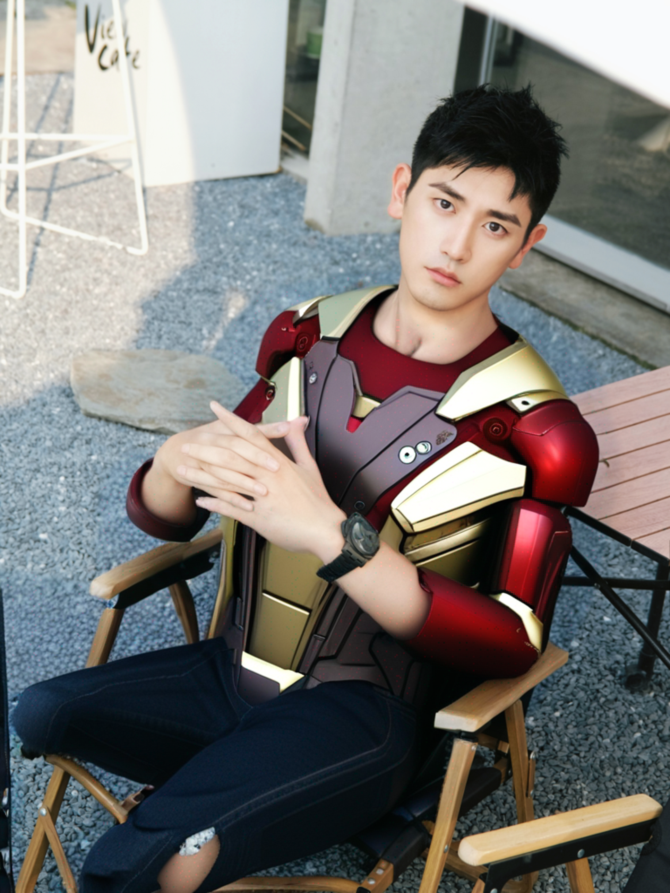</td>
    <td align="center"></td>
  </tr>

  <tr>
    <td align="center">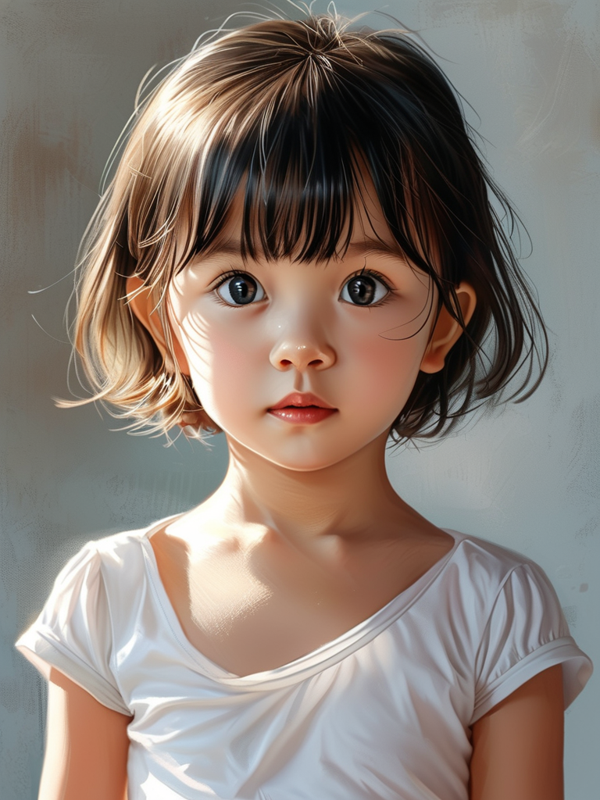</td>
    <td align="center">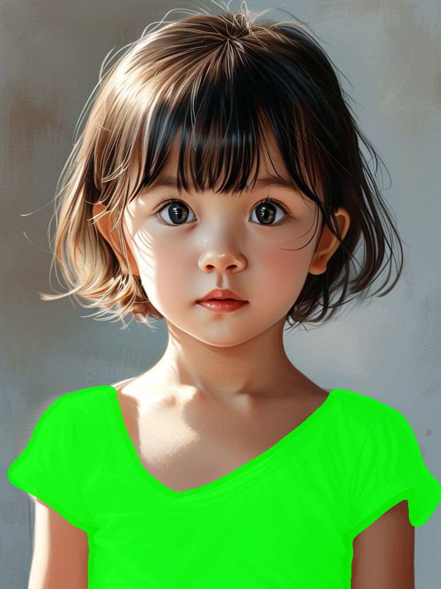</td>
    <td align="center"><font style="font-size:12px">穿着白雪公主的衣服，经典的蓝色裙子，并且在袖口处饰有红色细节，超高清，辛烷渲染，高级质感，32k</p> Dressed in Snow White's classic blue skirt with red details at the cuffs, Ultra HD, Octane Rendering, Premium Textures, 32k</font> </td> 
    <td align="center">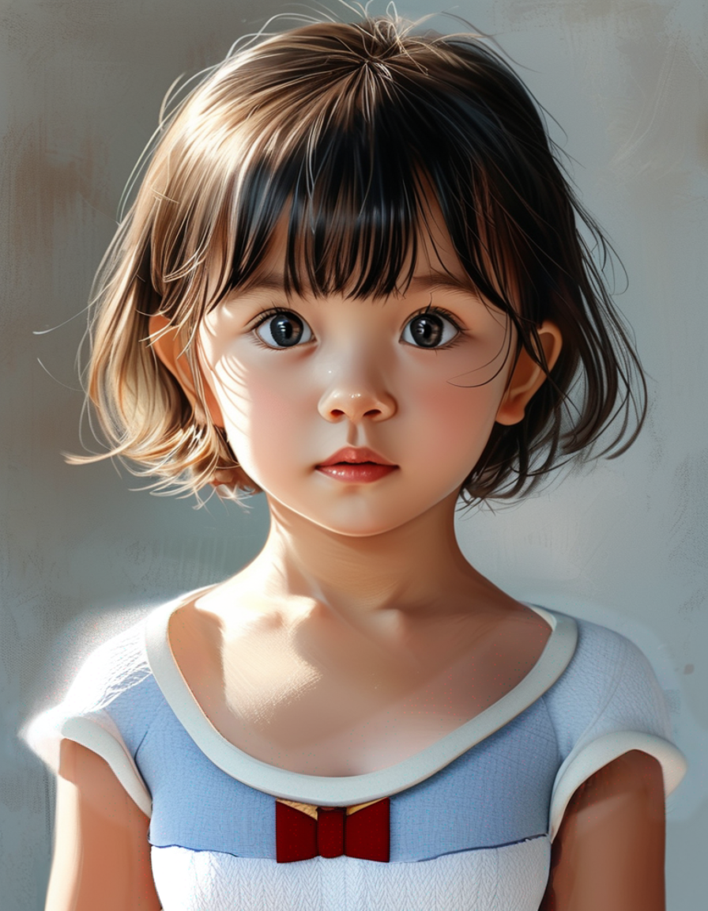</td>
    <td align="center">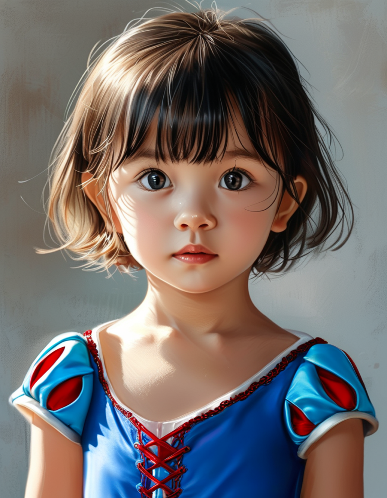</td>
  </tr>

  <tr>
    <td align="center">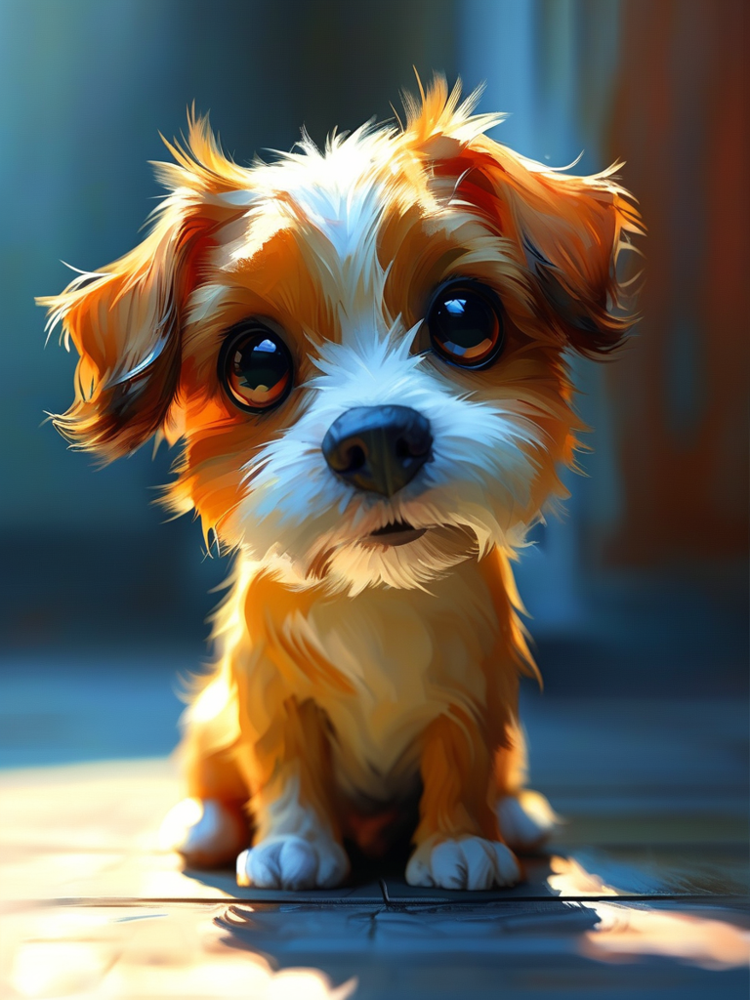</td>
    <td align="center">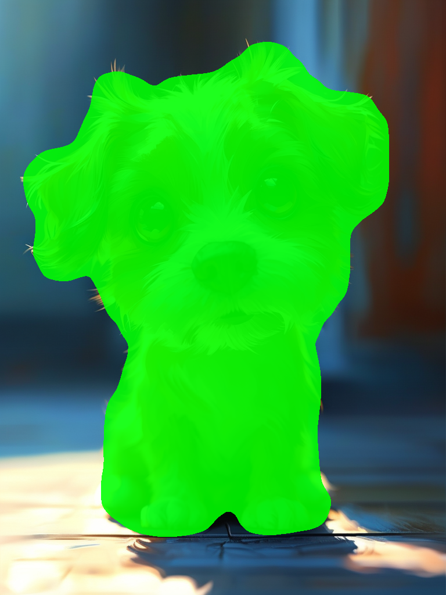</td>
    <td align="center"><font style="font-size:12px">一只带着红色帽子的小猫咪，圆脸，大眼，极度可爱，高饱和度，立体，柔和的光线</p> A kitten wearing a red hat, round face, big eyes, extremely cute, high saturation, three-dimensional, soft light</font> </td> 
    <td align="center">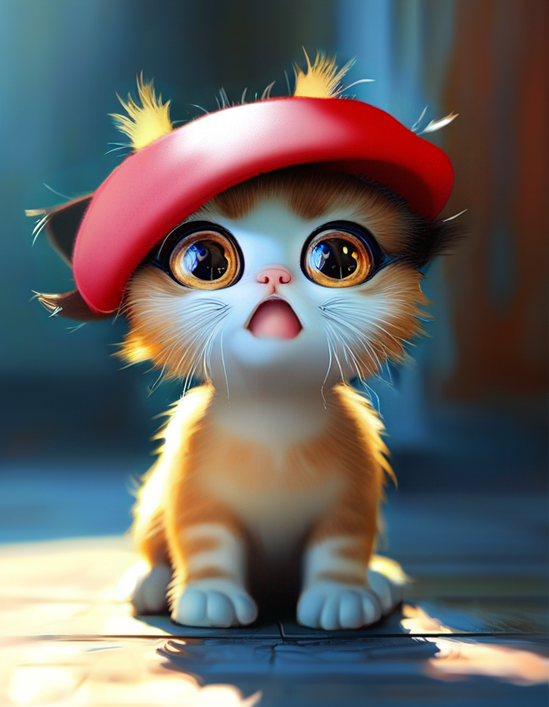</td>
    <td align="center">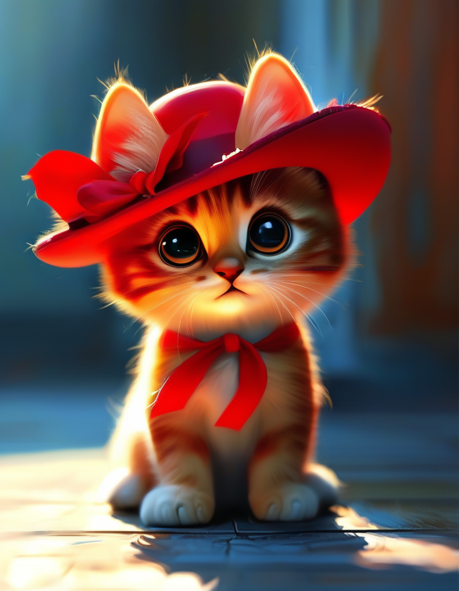</td>
  </tr>


  <tr>
    <td align="center">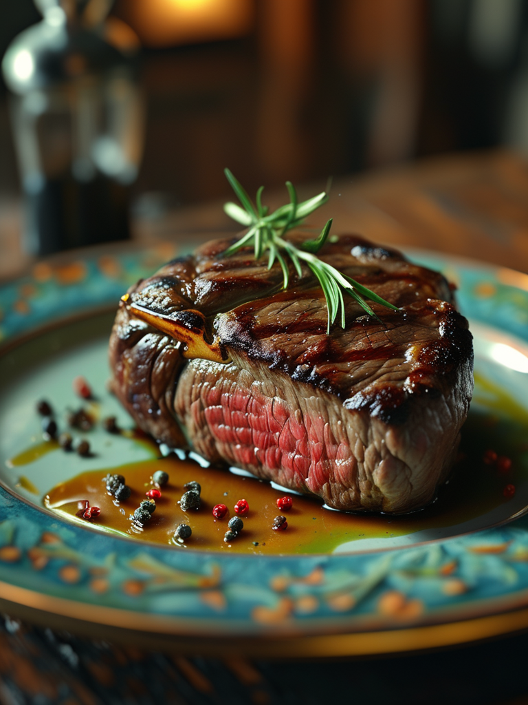</td>
    <td align="center">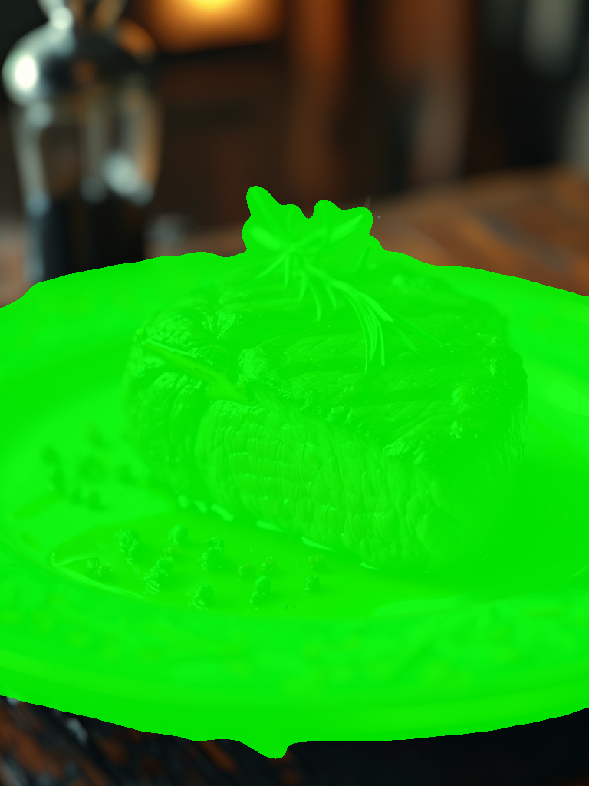</td>
    <td align="center"><font style="font-size:12px">这是一幅令人垂涎欲滴的火锅画面，各种美味的食材在翻滚的锅中煮着，散发出的热气和香气令人陶醉。火红的辣椒和鲜艳的辣椒油熠熠生辉，具有诱人的招人入胜之色彩。锅内肉质细腻的薄切牛肉、爽口的豆腐皮、鲍汁浓郁的金针菇、爽脆的蔬菜，融合在一起，营造出五彩斑斓的视觉呈现</p> This is a mouth-watering hot pot scene, with all kinds of delicious ingredients cooking in the boiling pot, emitting intoxicating heat and aroma. The fiery red peppers and bright chili oil are shining, with attractive and fascinating colors. The delicate thin-cut beef, refreshing tofu skin, enoki mushrooms with rich abalone sauce, and crisp vegetables in the pot are combined together to create a colorful visual presentation</font> </td> 
    <td align="center"></td>
    <td align="center">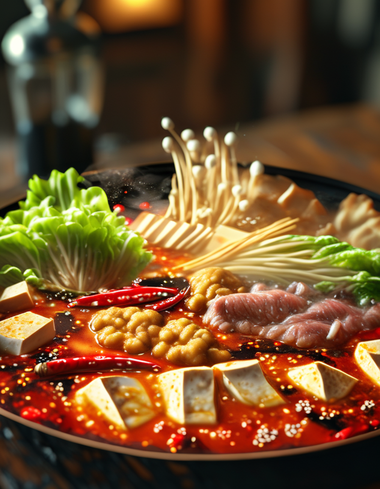</td>
  </tr>

  </tr>
  
</table>

<font color=gray style="font-size:10px"> *Kolors-Inpainting employs Chinese prompts, while SDXL-Inpainting uses English prompts.*</font>


## <a name="Usage"></a>🛠️ Usage

### Requirements

The dependencies and installation are basically the same as the [Kolors-BaseModel](https://huggingface.co/Kwai-Kolors/Kolors).

<br>

1. Repository Cloning and Dependency Installation

```bash
apt-get install git-lfs
git clone https://github.com/Kwai-Kolors/Kolors
cd Kolors
conda create --name kolors python=3.8
conda activate kolors
pip install -r requirements.txt
python3 setup.py install
```

2. Weights download [link](https://huggingface.co/Kwai-Kolors/Kolors-Inpainting)：
```bash
huggingface-cli download --resume-download Kwai-Kolors/Kolors-Inpainting --local-dir weights/Kolors-Inpainting
```

3. Inference：
```bash
python3 inpainting/sample_inpainting.py ./inpainting/asset/3.png ./inpainting/asset/3_mask.png 穿着美少女战士的衣服，一件类似于水手服风格的衣服，包括一个白色紧身上衣，前胸搭配一个大大的红色蝴蝶结。衣服的领子部分呈蓝色，并且有白色条纹。她还穿着一条蓝色百褶裙，超高清，辛烷渲染，高级质感，32k，高分辨率，最好的质量，超级细节，景深

python3 inpainting/sample_inpainting.py ./inpainting/asset/4.png ./inpainting/asset/4_mask.png 穿着钢铁侠的衣服，高科技盔甲，主要颜色为红色和金色，并且有一些银色装饰。胸前有一个亮起的圆形反应堆装置，充满了未来科技感。超清晰，高质量，超逼真，高分辨率，最好的质量，超级细节，景深

# The image will be saved to "scripts/outputs/"
```

<br>
