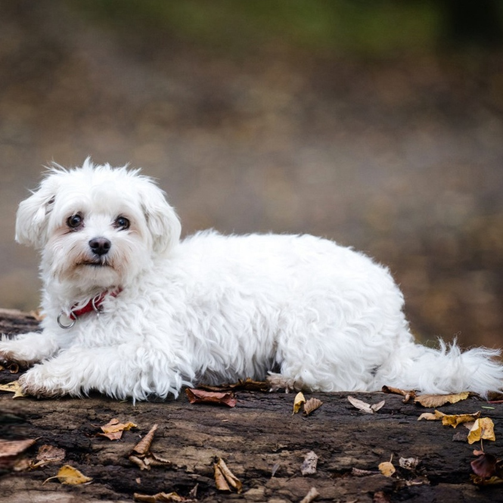
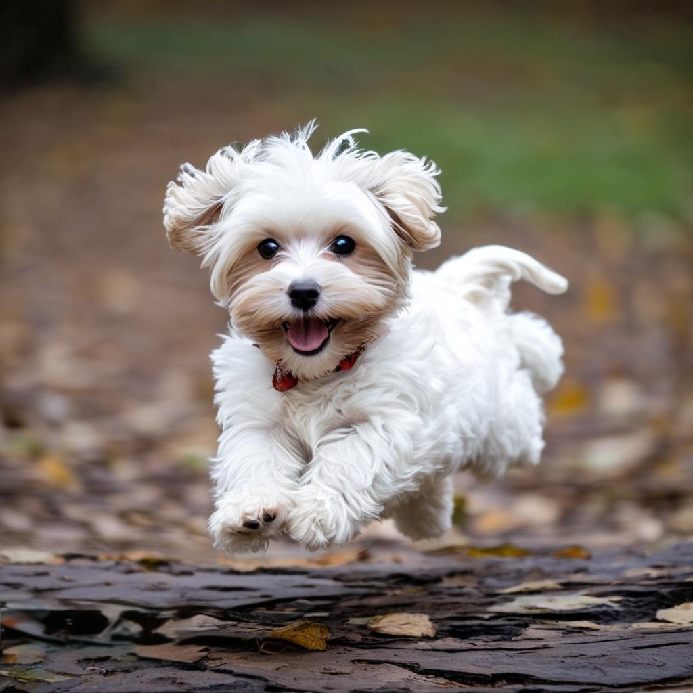

## <a name="Introduction"></a>📖 Introduction

We provide IP-Adapter-Plus weights and inference code based on [Kolors-Basemodel](https://huggingface.co/Kwai-Kolors/Kolors). Examples of Kolors-IP-Adapter results are as follows:


<table>
  <tr>
    <td colspan="3" align="center">Example result</td>
  </tr>
  
   <tr>
    <td align="center">Reference Image </td>
    <td align="center">Prompt </td>
    <td align="center">Result Image </td>
  </tr>

  <tr>
    <td align="center"></td>
    <td align="center">穿着黑色T恤衫，上面中文绿色大字写着“可图” </td>
    <td align="center"></td>
  </tr>

   <tr>
    <td align="center"></td>
    <td align="center">一直可爱的小狗在奔跑 </td>
    <td align="center"></td>
  </tr>

  </tr>
  
</table>


<br>

**Our improvements**

- A stronger image feature extractor. We employ the Openai-CLIP-336 model as image encoder network, which allows us to preserve more details in the reference images
- More diverse and high-quality training data. We construct a larger scale of high-quality training data, inspired by other work's data strategy. we believe that paired training data can effectively improve the model's performance.


<br>


## <a name="Evaluation"></a>📊 Evaluation
For evaluation, We created a test set consisting of over 200 reference images and text prompts. We invited several image experts to provide fair ratings for the generated results of different models. The experts rated the generated images based on four criteria: visual appeal, text faithfulness, Image faithfulness and overall satisfaction. Image faithfulness measures the semantic preservation ability of IPAdapter on reference images, while the other criteria follow the evaluation standards of BaseModel. The specific results are summarized in the table below, where Kolors-IP-Adapter achieved the highest overall satisfaction score. 


|       Model       |  Average Overall Satisfaction | Average Image Faithfulness | Average Visual Appeal | Average Text Faithfulness |
| :--------------: | :--------: | :--------: | :--------: | :--------: |
| SDXL-IP-Adapter-Plus |	2.29	| 2.64	| 3.22	| 4.02 |
| Midjourney-v6-CW |	2.79	| 3.0	| 3.92	| 4.35 |
|    **Kolors**    | **3.04** |  **3.25**    |    **4.45**    |    **4.30**    |

- <font color=gray>*The ip_scale parameter is set to 0.3 in SDXL-IP-Adapter-Plus, while Midjourney-v6-CW utilizes the default cw scale.*</font>

------

<br>


<table>
  <tr>
    <td colspan="5" align="center">Compare result</td>
  </tr>
  
   <tr>
    <td align="center">Reference image </td>
    <td align="center">Prompt </td>
    <td align="center">Kolors-IP-Adapter-Plus result </td>
    <td align="center">SDXL-IP-Adapter-Plus result </td>
    <td align="center">Midjourney-v6-CW result </td>
  </tr>

  <tr>
    <td align="center"></td>
    <td align="center">穿着黑色T恤衫，上面中文绿色大字写着“可图” </td>
    <td align="center"> </td>
    <td align="center"> </td>
    <td align="center"> </td>
  </tr>

   <tr>
    <td align="center"></td>
    <td align="center">一直可爱的小狗在奔跑 </td>
    <td align="center"></td>
    <td align="center"></td>
    <td align="center"></td>
  </tr>

  </tr>
  
</table>


## <a name="Usage"></a>🛠️ Usage

### Requirements

The dependencies and installation are basically the same as the [Kolors-BaseModel](https://huggingface.co/Kwai-Kolors/Kolors).

<br>

1. Repository Cloning and Dependency Installation

```bash
apt-get install git-lfs
git clone https://github.com/Kwai-Kolors/Kolors
cd Kolors
conda create --name kolors python=3.8
conda activate kolors
pip install -r requirements.txt
python3 setup.py install
```

2. Weights download（[link](https://huggingface.co/Kwai-Kolors/Kolors-IP-Adapter-Plus)）：
```bash
huggingface-cli download --resume-download Kwai-Kolors/Kolors-IP-Adapter-Plus --local-dir weights/Kolors-IP-Adapter-Plus
```
or
```bash
git lfs clone https://huggingface.co/Kwai-Kolors/Kolors-IP-Adapter-Plus weights/Kolors-IP-Adapter-Plus
```

3. Inference：
```bash
python ipadapter/sample_ipadapter_plus.py ./ipadapter/assert/test_ip.jpg "穿着黑色T恤衫，上面中文绿色大字写着“可图”"

python ipadapter/sample_ipadapter_plus.py ./ipadapter/assert/test_ip2.jpg "一直可爱的小狗在奔跑"

# The image will be saved to "scripts/outputs/sample_test_ip.jpg"
```

<br>

**Note**

The IP-Adapter-Face model based on Kolors will also be released soon!


### Acknowledgments
- Thanks to [IP-Adapter](https://github.com/tencent-ailab/IP-Adapter) for providing the codebase.
<br>

