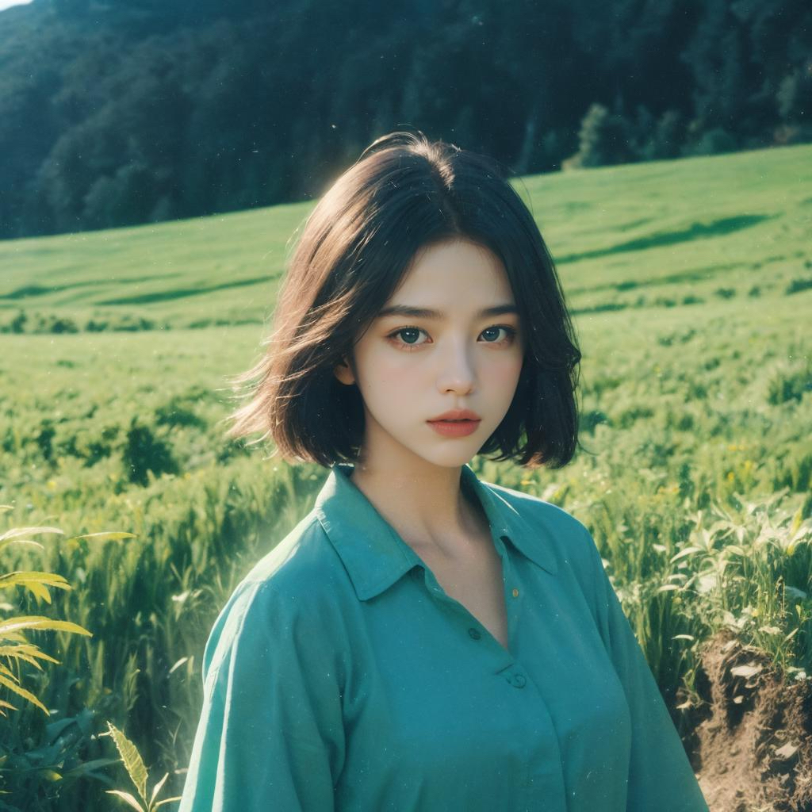
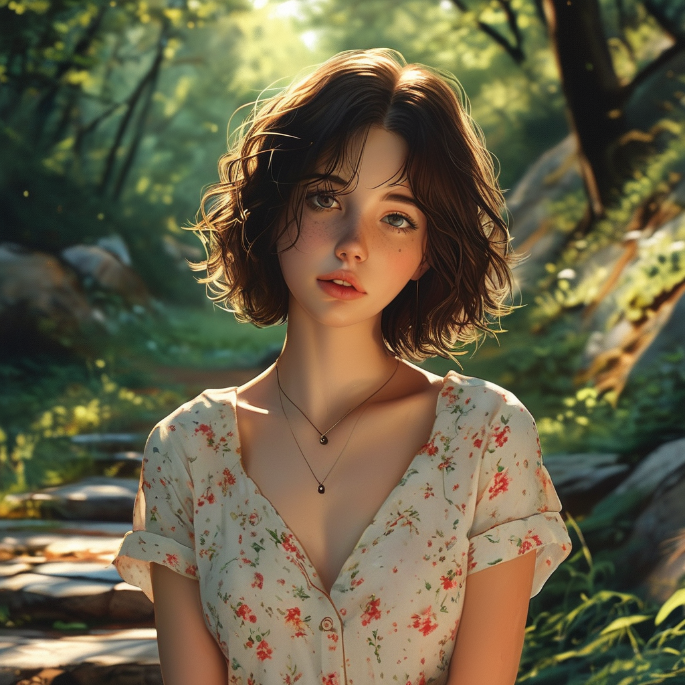
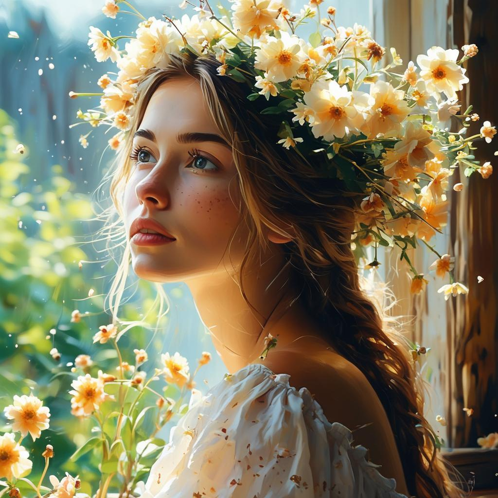
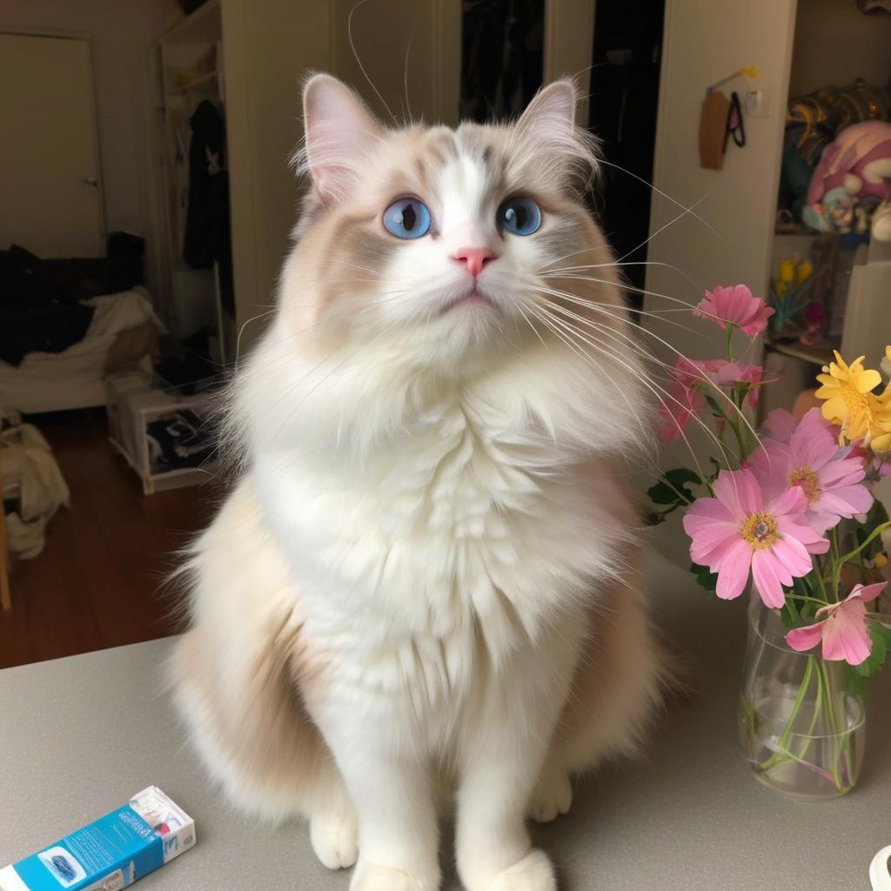
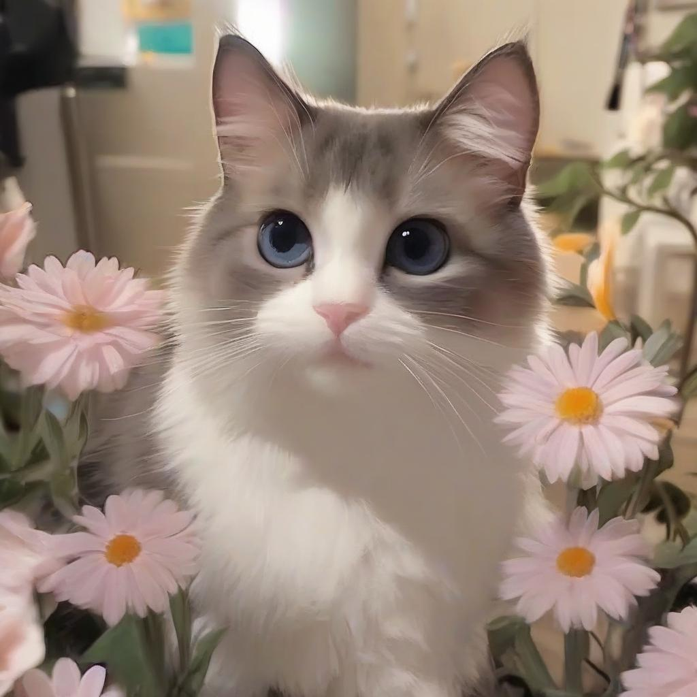
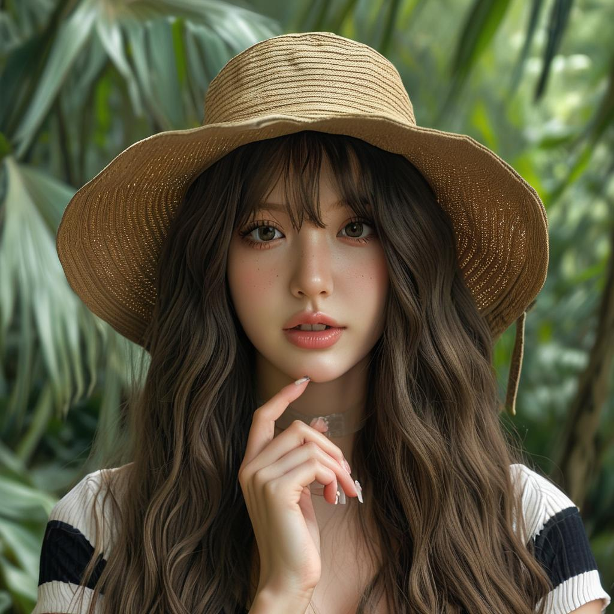
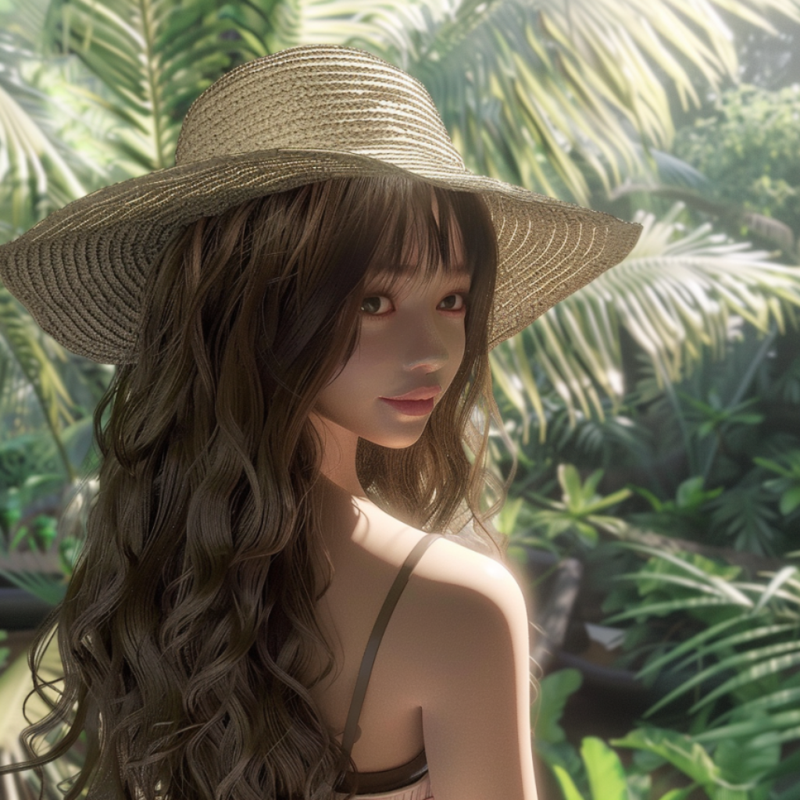
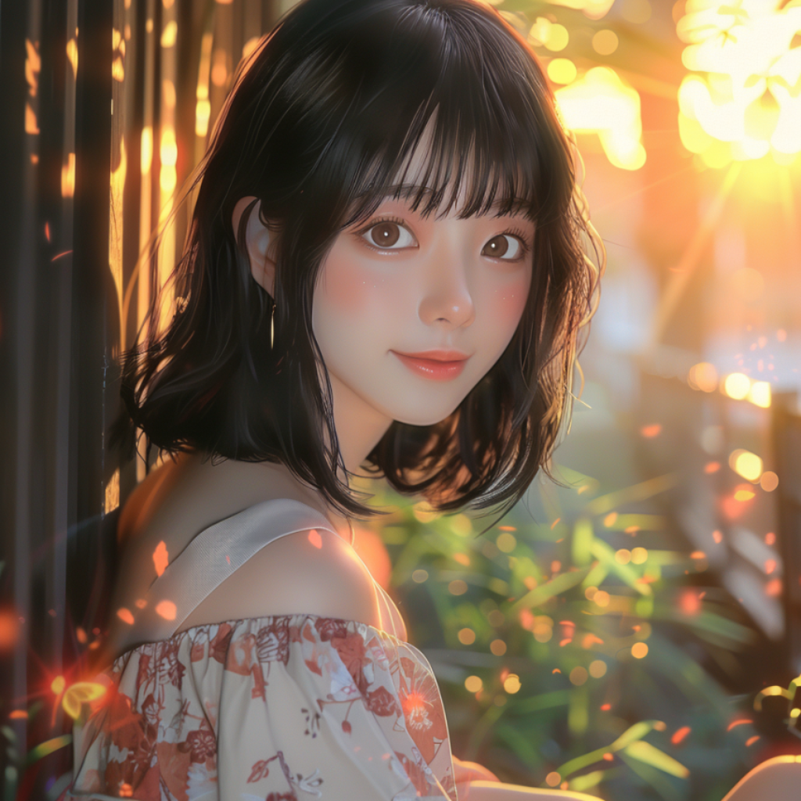

## <a name="Introduction"></a>📖 Introduction

We provide IP-Adapter-Plus weights and inference code based on [Kolors-Basemodel](https://huggingface.co/Kwai-Kolors/Kolors). Examples of Kolors-IP-Adapter-Plus results are as follows:


<table >
  <tr>
    <td colspan="3" align="center">Example Result</td>
  </tr>
  
   <tr>
    <td align="center">Reference Image </td>
    <td align="center">Prompt </td>
    <td align="center">Result Image </td>
  </tr>

  <tr>
    <td align="center"></td>
    <td align="center"><font style="font-size:12px">穿着黑色T恤衫，上面中文绿色大字写着“可图”。</p> Wearing a black T-shirt with the Chinese characters "Ketu" written in large green letters on it. </font> </td> 
    <td align="center"></td>
  </tr>

  <tr>
    <td align="center"></td>
    <td align="center"><font style="font-size:12px">一只可爱的小狗在奔跑。</p>A cute dog is running. </font> </td> 
    <td align="center"></td>
  </tr>

  
</table>


<br>

**Our improvements**

- A stronger image feature extractor. We employ the Openai-CLIP-336 model as the image encoder, which allows us to preserve more details in the reference images
- More diverse and high-quality training data: We construct a large-scale and high-quality training dataset inspired by the data strategies of other works. We believe that paired training data can effectively improve performance.


<br>


## <a name="Evaluation"></a>📊 Evaluation
For evaluation, we create a test set consisting of over 200 reference images and text prompts. We invite several image experts to provide fair ratings for the generated results of different models. The experts rate the generated images based on four criteria: visual appeal, text faithfulness, image faithfulness, and overall satisfaction. Image faithfulness measures the semantic preservation ability of IP-Adapter on reference images, while the other criteria follow the evaluation standards of BaseModel. The specific results are summarized in the table below, where Kolors-IP-Adapter-Plus achieves the highest overall satisfaction score.

|       Model       |  Average Overall Satisfaction | Average Image Faithfulness | Average Visual Appeal | Average Text Faithfulness |
| :--------------: | :--------: | :--------: | :--------: | :--------: |
| SDXL-IP-Adapter-Plus |	2.29	| 2.64	| 3.22	| 4.02 |
| Midjourney-v6-CW |	2.79	| 3.0	| 3.92	| 4.35 |
|    **Kolors-IP-Adapter-Plus**    | **3.04** |  **3.25**    |    **4.45**    |    **4.30**    |

<font color=gray style="font-size:12px">*The ip_scale parameter is set to 0.3 in SDXL-IP-Adapter-Plus, while Midjourney-v6-CW utilizes the default cw scale.*</font>

------

<br>


<table>
  <tr>
    <td colspan="5" align="center">Compare Result</td>
  </tr>
  
  <tr>
    <td align="center">Reference Image </td>
    <td align="center">Prompt </td>
    <td align="center">Kolors-IP-Adapter-Plus Result </td>
    <td align="center">SDXL-IP-Adapter-Plus Result </td>
    <td align="center">Midjourney-v6-CW Result </td>
  </tr>

  <tr>
    <td align="center"></td>
    <td align="center"><font style="font-size:10px">一个看向远山的少女形象，雪山背景，采用日本浮世绘风格，混合蓝色和红色柔和调色板，高分辨率 </p>Image of a girl looking towards distant mountains, snowy mountains background, in Japanese ukiyo-e style, mixed blue and red pastel color palette, high resolution.</font> </td>
    <td align="center"> </td>
    <td align="center"> </td>
    <td align="center"> </td>
  </tr>

  <tr>
    <td align="center"></td>
    <td align="center"><font style="font-size:10px">一个漂亮的美女，看向远方</p>A beautiful lady looking into the distance. </font></td>
    <td align="center"> </td>
    <td align="center"> </td>
    <td align="center"> </td>
  </tr>

  <tr>
    <td align="center"></td>
    <td align="center"><font style="font-size:10px">可爱的猫咪，在花丛中，看镜头</p>Cute cat among flowers, looking at the camera. </font></td>
    <td align="center"> </td>
    <td align="center"> </td>
    <td align="center"> </td>
  </tr>

  <tr>
    <td align="center"></td>
    <td align="center"><font style="font-size:10px">站在丛林前，戴着太阳帽，高画质，高细节，高清，疯狂的细节，超高清 </p>Standing in front of the jungle, wearing a sun hat, high quality, high detail, high definition, crazy details, ultra high definition.</font></td>
    <td align="center"> </td>
    <td align="center"> </td>
    <td align="center"> </td>
  </tr>


  <tr>
    <td align="center"></td>
    <td align="center"><font style="font-size:10px">做个头像，新海诚动漫风格，丰富的色彩，唯美风景，清新明亮，斑驳的光影，最好的质量，超细节，8K画质 </p>Create an avatar, Shinkai Makoto anime style, rich colors, beautiful scenery, fresh and bright, mottled light and shadow, best quality, ultra-detailed, 8K quality.</font></td>
    <td align="center"> </td>
    <td align="center"> </td>
    <td align="center"> </td>
  </tr>

  </tr>
  
</table>

<font color=gray style="font-size:12px"> *Kolors-IP-Adapter-Plus employs chinese prompts, while other methods use english prompts.*</font>


## <a name="Usage"></a>🛠️ Usage

### Requirements

The dependencies and installation are basically the same as the [Kolors-BaseModel](https://huggingface.co/Kwai-Kolors/Kolors).

<br>

1. Repository Cloning and Dependency Installation

```bash
apt-get install git-lfs
git clone https://github.com/Kwai-Kolors/Kolors
cd Kolors
conda create --name kolors python=3.8
conda activate kolors
pip install -r requirements.txt
python3 setup.py install
```

2. Weights download [link](https://huggingface.co/Kwai-Kolors/Kolors-IP-Adapter-Plus)：
```bash
huggingface-cli download --resume-download Kwai-Kolors/Kolors-IP-Adapter-Plus --local-dir weights/Kolors-IP-Adapter-Plus
```
or
```bash
git lfs clone https://huggingface.co/Kwai-Kolors/Kolors-IP-Adapter-Plus weights/Kolors-IP-Adapter-Plus
```

3. Inference：
```bash
python ipadapter/sample_ipadapter_plus.py ./ipadapter/asset/test_ip.jpg "穿着黑色T恤衫，上面中文绿色大字写着“可图”"

python ipadapter/sample_ipadapter_plus.py ./ipadapter/asset/test_ip2.png "一只可爱的小狗在奔跑"

# The image will be saved to "scripts/outputs/"
```

<br>


**Note**

The IP-Adapter-FaceID model based on Kolors will also be released soon!

<br>

### Acknowledgments
- Thanks to [IP-Adapter](https://github.com/tencent-ailab/IP-Adapter) for providing the codebase.
<br>

