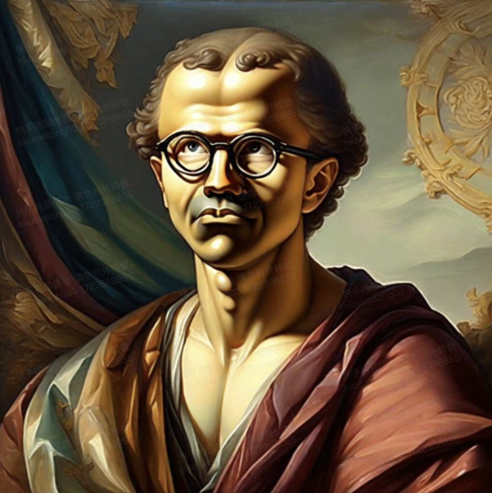
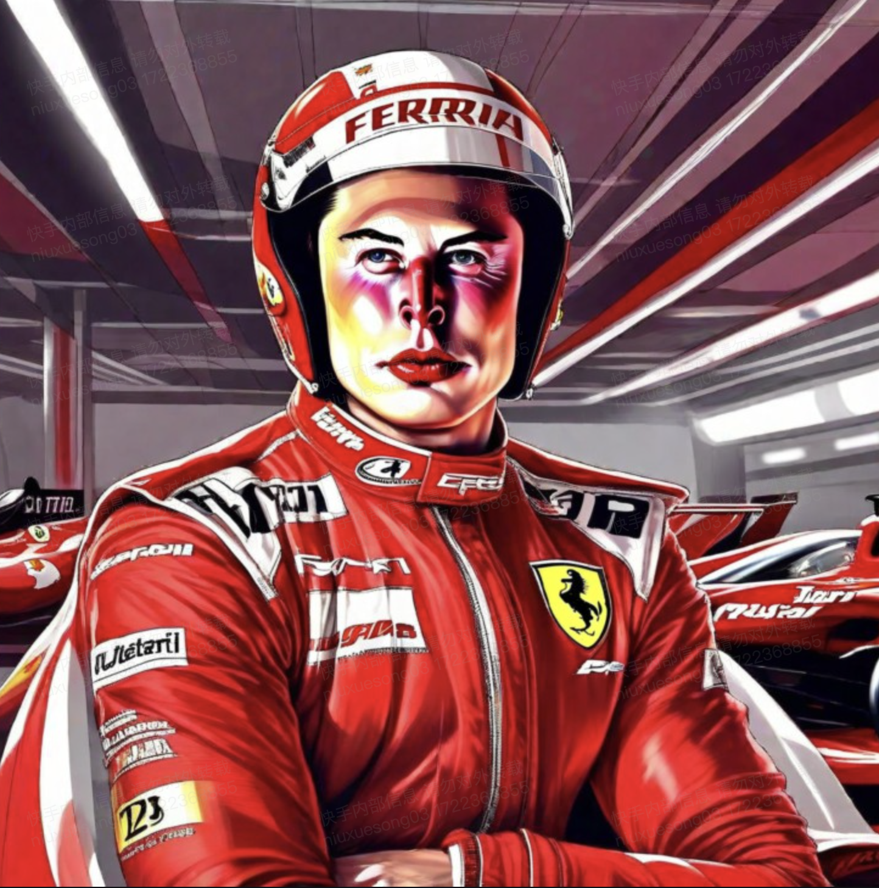

## <a name="Introduction"></a>📖 Introduction

We provide Kolors-IP-Adapter-FaceID-Plus module weights and inference code based on [Kolors-Basemodel](https://huggingface.co/Kwai-Kolors/Kolors). Examples of Kolors-IP-Adapter-FaceID-Plus results are as follows:


<table>
  <tr>
    <td colspan="3" align="center">Example Results</td>
  </tr>
  
   <tr>
    <td align="center">Reference Image </td>
    <td align="center">Prompt </td>
    <td align="center">Result Image </td>
  </tr>

  <tr>
    <td align="center"></td>
    <td align="center"><font style="font-size:12px"> 穿着晚礼服，在星光下的晚宴场景中，烛光闪闪，整个场景洋溢着浪漫而奢华的氛围 </p> Wearing an evening dress, in a starry night banquet scene, candlelight flickering, the whole scene exudes a romantic and luxurious atmosphere. </font> </td> 
    <td align="center"></td>
  </tr>

  <tr>
    <td align="center"></td>
    <td align="center"><font style="font-size:12px"> 西部牛仔，牛仔帽，荒野大镖客，背景是西部小镇，仙人掌，,日落余晖, 暖色调, 使用XT4胶片拍摄, 噪点, 晕影, 柯达胶卷，复古 </p> Western cowboy, cowboy hat, Red Dead Redemption, background is a western town, cactus, sunset glow, warm tones, shot with XT4 film, grain, vignette, Kodak film, retro. </font> </td> 
    <td align="center"></td>
  </tr>
</table>

- Our Kolors-IP-Adapter-FaceID-Plus module is trained on a large-scale and high-quality face dataset. We use the face ID embeddings generated by [insightface](https://github.com/deepinsight/insightface) and the CLIP features of face area to keep the face ID and structure information.

## <a name="Evaluation"></a>📊 Evaluation
For evaluation, we constructed a test set consisting of over 200 reference images and text prompts. We invited several image experts to provide fair ratings for the generated results of different models. The experts assessed the generated images based on five criteria: visual appeal, text faithfulness, face similarity, facial aesthetics and overall satisfaction. Visual appeal and text faithfulness are used to measure the text-to-image generation capability, adhering to the evaluation standards of BaseModel. Meanwhile, face similarity and facial aesthetics are used to evaluate the performance of the proposed Kolors-IP-Adapter-FaceID-Plus. The results are summarized in the table below, where Kolors-IP-Adapter-FaceID-Plus outperforms SDXL-IP-Adapter-FaceID-Plus across all metrics.


|       Model       |  Average Text Faithfulness | Average Visual Appeal | Average Face Similarity | Average Facial Aesthetics | Average Overall Satisfaction |
| :--------------: | :--------: | :--------: | :--------: | :--------: | :--------: |
| SDXL-IP-Adapter-FaceID-Plus |	4.014	| 3.455	| 3.05	| 2.584	| 2.448 |
| **Kolors-IP-Adapter-FaceID-Plus** | **4.235** |  **4.374**  | **4.415** | **3.887** | **3.561** |
------

<br>


<table>
  <tr>
    <td colspan="4" align="center"> Comparison Results </td>
  </tr>
  
  <tr>
    <td align="center">Reference Image </td>
    <td align="center">Prompt </td>
    <td align="center">SDXL-IP-Adapter-FaceID-Plus </td>
    <td align="center">Kolors-IP-Adapter-FaceID-Plus </td>
  </tr>

  <tr>
    <td align="center"></td>
    <td align="center"><font style="font-size:10px">古典油画风格，油彩厚重, 古典美感，历史气息 </p> Classical oil painting style, thick oil paint, classical aesthetic, historical atmosphere. </font> </td>
    <td align="center"> </td>
    <td align="center"> </td>
  </tr>

  <tr>
    <td align="center"></td>
    <td align="center"><font style="font-size:10px">夜晚，浪漫的海边，落日余晖洒在海面上，晚霞映照着整个海滩，头戴花环，花短袖，飘逸的头发，背景是美丽的海滩，可爱年轻的半身照，优雅梦幻，细节繁复，超逼真，高分辨率，柔和的背景，低对比度 </p> Night, romantic seaside, sunset glow on the sea, evening glow reflecting on the whole beach, wearing a flower crown, short floral sleeves, flowing hair, background is a beautiful beach, cute young half-body portrait, elegant and dreamy, intricate details, ultra-realistic, high resolution, soft background, low contrast.</font> </td>
    <td align="center"> </td>
    <td align="center"> </td>
  </tr>

  <tr>
    <td align="center"></td>
    <td align="center"><font style="font-size:10px">F1赛车手, 法拉利，戴着着红黑白相间的赛车手头盔，帅气的赛车手，飞舞的彩带，背景赛车车库和天花板泛光，璀璨闪光，穿红白黑相间赛车服，色调统一且明艳，面部白皙，面部特写，正视图 </p>F1 racer, Ferrari, wearing a red, black, and white racing helmet, handsome racer, flying ribbons, background race car garage and ceiling lights, dazzling flashes, wearing red, white, and black racing suit, unified and bright color tone, fair face, facial close-up, front view.</font> </td>
    <td align="center"> </td>
    <td align="center"> </td>
  </tr>

  <tr>
    <td align="center"></td>
    <td align="center"><font style="font-size:10px">和服，日本传统服饰，在海边的黄昏，远山的背景，在远处的烟火，柔和的灯光，长焦镜头，夜间摄影风格，凉爽的色调，浪漫的气氛，火花四溅，时尚摄影，胶片滤镜 </p> Kimono, traditional Japanese clothing, at the seaside at dusk, distant mountain background, fireworks in the distance, soft lighting, telephoto lens, night photography style, cool tones, romantic atmosphere, sparks flying, fashion photography, film filter.</font> </td>
    <td align="center"> </td>
    <td align="center"> </td>
  </tr>
  
</table>

<font color=gray style="font-size:12px"> *Kolors-IP-Adapter-FaceID-Plus employs chinese prompts, while SDXL-IP-Adapter-FaceID-Plus uses english prompts.*</font>

## <a name="Usage"></a>🛠️ Usage

### Requirements

The dependencies and installation are basically the same as the [Kolors-BaseModel](https://huggingface.co/Kwai-Kolors/Kolors).

<br>

1. Repository Cloning and Dependency Installation

```bash
apt-get install git-lfs
git clone https://github.com/Kwai-Kolors/Kolors
cd Kolors
conda create --name kolors python=3.8
conda activate kolors
pip install -r requirements.txt
pip install insightface onnxruntime-gpu
python3 setup.py install
```

2. Weights download [link](https://huggingface.co/Kwai-Kolors/Kolors-IP-Adapter-FaceID-Plus)：
```bash
huggingface-cli download --resume-download Kwai-Kolors/Kolors-IP-Adapter-FaceID-Plus --local-dir weights/Kolors-IP-Adapter-FaceID-Plus
```
or
```bash
git lfs clone https://huggingface.co/Kwai-Kolors/Kolors-IP-Adapter-FaceID-Plus weights/Kolors-IP-Adapter-FaceID-Plus
```

3. Inference：
```bash
python ipadapter_FaceID/sample_ipadapter_faceid_plus.py ./ipadapter_FaceID/assets/image1.png "穿着晚礼服，在星光下的晚宴场景中，烛光闪闪，整个场景洋溢着浪漫而奢华的氛围"

python ipadapter_FaceID/sample_ipadapter_faceid_plus.py ./ipadapter_FaceID/assets/image2.png "西部牛仔，牛仔帽，荒野大镖客，背景是西部小镇，仙人掌，,日落余晖, 暖色调, 使用XT4胶片拍摄, 噪点, 晕影, 柯达胶卷，复古"

# The image will be saved to "scripts/outputs/"
```

### Acknowledgments
- Thanks to [insightface](https://github.com/deepinsight/insightface) for the face representations.
- Thanks to [IP-Adapter](https://github.com/tencent-ailab/IP-Adapter) for the codebase.
<br>

